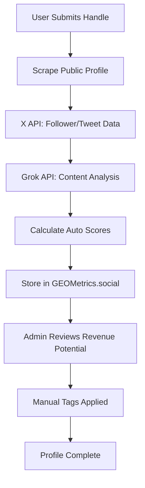
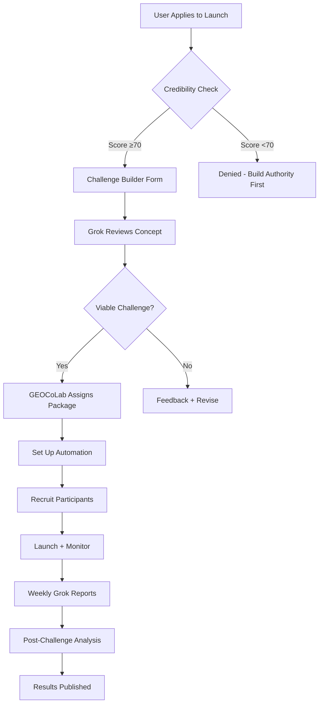

# **Signal > Spam Challenge: The Complete Framework**

*A Grok-Aligned Social Optimization System for X*

---

## **1. SOCIAL SIGNAL: The X Algorithm Context**

### **What is "Signal" on X?**

Signal represents **meaningful, contextual engagement** that X's algorithm (and AI systems like Grok) prioritize for content distribution and recommendation. Think of it as the "semantic weight" of your interactions.

#### **ValueSurplusRule:**

```typescript
/**
 * ValueSurplusRule
 * Algorithm-aligned engagement doctrine based on X OSS (Phoenix Scorer + Weighted Ranker).
 * 5:3:2+ represents priority tiers, NOT raw action counts.
 * Low-signal actions are capped, diversified, and treated as confidence modifiers.
 */
export interface ValueSurplusRule {
  /**
   * Tier 1 — High-Intent / Authority-Building Signals
   * Typical weights: 10x–75x
   */
  tier1: {
    meaningfulReplies: number;        // ≥2 (13.5x, >50 chars, insight-driven)
    authorEngagedReplies?: number;    // ≥1 if achieved (75x)
    conversationEngagement?: number;  // ≥1 multi-turn thread (≈11x)
    bookmarks: number;                // ≥1 (highest implicit intent)
    followAuthor?: number;            // ≥1 (contextual, authority-gated)
  };

  /**
   * Tier 2 — Medium-Intent / Trust & Exploration Signals
   * Typical weights: 1x–12x
   */
  tier2: {
    profileClicks: number;            // ≥1 (≈12x trust signal)
    quotePosts?: number;              // ≥1 (analysis-driven, >100 chars)
    targetedShares?: number;          // ≥1 (selective amplification)
  };

  /**
   * Tier 3 — Low-Intent / Baseline Signals (Symbolic "2")
   * Typical weights: 0.005x–1x
   * CAPPED and pattern-sensitive
   */
  tier3: {
    likes: number;                    // ≤5 per session (strategic only)
    reposts?: number;                 // ≤2 per session
  };

  /**
   * Cross-Cutting Modifiers ("+")
   * Do not count as tiers; increase confidence and retention
   */
  modifiers: {
    dwellInstances?: number;          // ≥1 (>120s linger)
    photoExpands?: number;            // Optional (≈0.5x)
    linkOrMediaClicks?: number;        // Optional (≈0.5x)
    videoViews50pct?: number;          // Optional (≈0.005x, completion-biased)
  };

  /**
   * Negative/Spam Signal Guards (Amplified 2–5x penalties)
   */
  guards: SpamSignals;
}

export interface SpamSignals {
  noGenericReplies: boolean;
  noMassLiking: boolean;             // Pattern-based, not numeric
  noFollowChurn: boolean;
  avoidDismissSignals: boolean;      // scroll-away, rapid skips
  zeroToleranceActions: boolean;     // block, mute, report
  // Automation Red Flags
  perfectTimingPatterns: boolean;   // Robotic posting schedules
  copyPasteDetection: number;       // Duplicate comment text
  massFollowUnfollow: number;       // Churn ratio
  
  // Engagement Gaming
  reciprocalLikeLoops: number;      // Like-for-like patterns
  emptyEngagement: number;          // "Great post!" comments
  selfPromotionRatio: number;       // Link-dropping without value
  
  // Content Quality Issues
  clickbaitScore: number;           // Misleading headlines
  controversialBaiting: number;     // Rage farming
  offTopicDeviation: number;        // Random niche jumping
}
```

---

### **How X/Grok Processes Signal:**

Grok and X's recommendation algorithm use a **multi-factor scoring system**:

1. **Immediate Signals (0-10 minutes):**
   - Like speed (too fast = bot suspicion)
   - Comment depth (character count + question marks + @mentions)
   - Profile click-through (did they actually read your bio?)

2. **Short-Term Signals (10 min - 24 hours):**
   - Bookmark actions (highest intent signal)
   - Quote tweet quality (original analysis vs echo)
   - Reply threading depth (1 comment vs 3-turn conversation)

3. **Long-Term Signals (24 hours - 30 days):**
   - Follow retention rate (do people stick around?)
   - Mutual engagement loops (A ↔ B consistent interactions)
   - Content clustering (your posts form coherent topic graphs)
   - Citation frequency (others linking/mentioning you)

4. **Network Authority Signals:**
   - **Verified follower ratio:** Premium/Premium+ followers weighted 3x
   - **Domain expertise markers:** Keywords in bio + post history coherence
   - **Cross-platform citations:** Links from Substack, LinkedIn, blogs

---

### **Signal > Spam Mathematical Model:**

```typescript
// Simplified X Algorithm Weighting
const calculateAccountSignal = (metrics: SignalMetrics): number => {
  const weights = {
    semanticRelevance: 0.25,      // 25% - Topic authority
    contextDepth: 0.20,           // 20% - Engagement quality
    followerVerifiedRatio: 0.15,  // 15% - Network quality
    citationFrequency: 0.15,      // 15% - External validation
    nicheCoherence: 0.10,         // 10% - Consistency
    dwellTime: 0.10,              // 10% - User attention
    bookmarkRate: 0.05            // 5% - High-intent saves
  };
  
  return Object.entries(metrics).reduce((score, [key, value]) => {
    return score + (value * (weights[key] || 0));
  }, 0);
};

// Spam Penalty Multiplier
const spamPenalty = (spamSignals: SpamSignals): number => {
  const penalties = {
    perfectTimingPatterns: -0.3,  // -30% if bot-like
    copyPasteDetection: -0.2,     // -20% for duplicate text
    massFollowUnfollow: -0.4,     // -40% for churn
    emptyEngagement: -0.15,       // -15% for low-value comments
    selfPromotionRatio: -0.1      // -10% for link spam
  };
  
  return 1 - Object.entries(spamSignals).reduce((penalty, [key, value]) => {
    return penalty + (value ? Math.abs(penalties[key] || 0) : 0);
  }, 0);
};

// Final Account Score
const finalScore = calculateAccountSignal(metrics) * spamPenalty(spamSignals);
```

**Key Insight:** A single high-signal action (e.g., a 200-character analytical comment that gets bookmarked) can outweigh 50 low-signal likes.

---

## **2. CHALLENGE 5:3:2+ Rule Based on X Algorithm Insights**

### Proposed: **The 5:3:2 Value Surplus Rule**

**Core Philosophy**: Weighted signal contributions that mirror X's ranking algorithm priorities.

#### Rule Structure

```typescript
/**
 * ValueSurplusRule
 * Algorithm-aligned engagement doctrine based on X OSS (Phoenix Scorer + Weighted Ranker).
 * 5:3:2+ represents priority tiers, NOT raw action counts.
 * Low-signal actions are capped, diversified, and treated as confidence modifiers.
 */
export interface ValueSurplusRule {
  /**
   * Tier 1 — High-Intent / Authority-Building Signals
   * Typical weights: 10x–75x
   */
  attack: {
    meaningfulReplies: number;        // ≥2 (13.5x, >50 chars, insight-driven)
    authorEngagedReplies?: number;    // ≥1 if achieved (75x)
    conversationEngagement?: number;  // ≥1 multi-turn thread (≈11x)
    bookmarks: number;                // ≥1 (highest implicit intent)
    followAuthor?: number;            // ≥1 (contextual, authority-gated)
  };

  /**
   * Tier 2 — Medium-Intent / Trust & Exploration Signals
   * Typical weights: 1x–12x
   */
  midfield: {
    profileClicks: number;            // ≥1 (≈12x trust signal)
    quotePosts?: number;              // ≥1 (analysis-driven, >100 chars)
    targetedShares?: number;          // ≥1 (selective amplification)
  };

  /**
   * Tier 3 — Low-Intent / Baseline Signals (Symbolic "2")
   * Typical weights: 0.005x–1x
   * CAPPED and pattern-sensitive
   */
  defence: {
    likes: number;                    // ≤5 per session (strategic only)
    reposts?: number;                 // ≤2 per session
  };

  /**
   * Cross-Cutting Modifiers ("+")
   * Do not count as tiers; increase confidence and retention
   */
  modifiers: {
    dwellInstances?: number;          // ≥1 (>120s linger)
    photoExpands?: number;            // Optional (≈0.5x)
    linkOrMediaClicks?: number;        // Optional (≈0.5x)
    videoViews50pct?: number;          // Optional (≈0.005x, completion-biased)
  };

  /**
   * Negative/Spam Signal Guards (Amplified 2–5x penalties)
   */
  guards: SpamSignals;
}

export interface SpamSignals {
  noGenericReplies: boolean;
  noMassLiking: boolean;             // Pattern-based, not numeric
  noFollowChurn: boolean;
  avoidDismissSignals: boolean;      // scroll-away, rapid skips
  zeroToleranceActions: boolean;     // block, mute, report
  // Automation Red Flags
  perfectTimingPatterns: boolean;   // Robotic posting schedules
  copyPasteDetection: number;       // Duplicate comment text
  massFollowUnfollow: number;       // Churn ratio
  
  // Engagement Gaming
  reciprocalLikeLoops: number;      // Like-for-like patterns
  emptyEngagement: number;          // "Great post!" comments
  selfPromotionRatio: number;       // Link-dropping without value
  
  // Content Quality Issues
  clickbaitScore: number;           // Misleading headlines
  controversialBaiting: number;     // Rage farming
  offTopicDeviation: number;        // Random niche jumping
}
```

#### The 5:3:2+ Breakdown

##### **5 High-Signal Actions (Depth & Trust)**

*(These create surplus value)*

Focus: **10×–75× multipliers**

* 2 **Meaningful replies**

  * > 50 characters
  * Add insight, not agreement
* 1 **Author-engaged reply**

  * OP responds directly (75×)
* 1 **Bookmark**

  * Highest implicit intent
* 1 **Conversation engagement**

  * Multi-turn thread participation **or**
* 1 **Follow (authority-qualified only)**

> 🔑 One Tier-1 action can outweigh dozens of likes.

> These 5 actions account for **~80–90% of session value**

---

##### **3 Medium-Signal Actions (Authority & Research)**

Focus: **1×–12× multipliers**

* 1 **profile click**
  (research before engagement – 12x signal)
* 1 **quote post with original analysis**
  (>100 chars, reframing or synthesis)
* 1 **share**
  (DM / contextual repost)

> These actions *validate intent* and reduce model uncertainty.

---

##### **2 Baseline Actions (Symbolic, Not Literal)**

* 5 **likes** (strategic, spaced)
* 2 **reposts** (value amplification only)

> Capped. Diversified. Non-bursty.

**Passive but encouraged (not counted):**

* ≥2 minutes **dwell time**
* ≥1 **video view** ≥50% playback

##### **+ Modifiers (Encouraged, Never Quota-Driven)**

These **increase confidence**, not rank by themselves:

* 1–2 **dwell events** (>2 min)
* Photo expand / media click
* Video view ≥50% playback

> Dwell is a *multiplier*, not a lever.

---

##### **Effective Daily Shape**

* ~10–12 deliberate actions
* ~80–90% of value from Tier 1 & 2
* Low spam risk, high survivability

---

##### Spoken (panels, workshops, challenges)

> “We use the **5 : 3 : 2+ rule** — five deep signals, three authority signals, two baseline signals.”

##### Written (docs, frameworks, scoring guides)
> **5 : 3 : 2+ is not an engagement tactic.
> It is a behavioral alignment with how X predicts satisfaction under uncertainty.**

##### Enforcement language (moderators / judges)

* Judge **tiers achieved**, not taps counted
* Bonus credit for **dwell + completion**
* Flags triggered by **imbalance**, not volume

##### One-line doctrine to lock this in

> **Low-signal actions are allowed to be many, but only allowed to matter a little.**

That sentence alone will defuse 90% of future confusion.

---

## **3. PARTICIPANT PROFILE DATA COLLECTION**

### **Auto-Retrievable Data (via X API / Scraping):**

✅ **Directly Scrapable from Public Profile:**

```typescript
interface AutoRetrievableData {
  // Basic Identity
  handle: string;                    // @username
  displayName: string;               // Profile name
  bio: string;                       // Description text
  profileLink: string;               // x.com/username
  
  // Verification Status
  accountType: 'Premium' | 'Premium+' | 'Free'; // Blue/gold checkmark
  verificationDate: Date;            // When verified (if Premium)
  
  // Follower Metrics
  followerCount: number;
  followingCount: number;
  tweetCount: number;
  accountAge: Date;                  // Join date
  
  // Content Analysis (last 100 tweets)
  primaryTopics: string[];           // ML topic extraction
  postingFrequency: number;          // Tweets/day avg
  engagementRate: number;            // (Likes+RTs+Replies)/Followers
  averageTweetLength: number;
  hashtagUsage: number;              // Avg hashtags/tweet
  mediaUsage: number;                // % tweets with images/video
  
  // Network Quality
  verifiedFollowerRatio: number;     // % Premium followers
  mutualFollowerCount: number;       // Shared connections
  listMemberships: number;           // How many lists include them
}
```

✅ **Derived via AI Analysis (Grok API / GPT-4):**

```typescript
interface AIAnalyzedData {
  // Content Classification
  primaryNiche: string;              // "GEO Expert" vs "AI Consultant"
  nichePurity: number;               // 0-1 consistency score
  expertiseLevel: 'Beginner' | 'Intermediate' | 'Advanced';
  
  // Intent Detection (last 50 tweets)
  intentDistribution: {
    askingHelp: number;              // % seeking advice
    complaining: number;             // % venting/criticism
    sharing: number;                 // % sharing resources
    teaching: number;                // % educational content
    debating: number;                // % argumentative
  };
  
  // Tone Analysis
  languageTone: 'Casual' | 'Technical' | 'Emotional' | 'Direct';
  sentimentScore: number;            // -1 (negative) to 1 (positive)
  professionalismIndex: number;      // 0-1 formality score
  
  // Authority Markers
  citationFrequency: number;         // Times mentioned by others
  originalContentRatio: number;      // % original vs retweets
  thoughtLeadershipScore: number;    // Long-form thread quality
}
```

❌ **Requires Manual Input:**

```typescript
interface ManualInputRequired {
  // Challenge-Specific Tracking
  secondTouchDone: boolean;          // Completed profile replies
  replyRoleUsed: 'Diagnostician' | 'Contrarian' | 'Translator' | 'Catalyst';
  replyHookType: 'Question-Ended' | 'Contrarian' | 'Empathy-First' | 'Authority-Frame';
  
  // Revenue Qualification
  revenuePotential: 'Low' | 'Med' | 'High';
  revenueNotes: string;              // "Has budget", "Needs nurturing"
  
  // Custom Tags
  futurePromptTag: string;           // "AI Visibility Lead"
}
```

---

### **Enhanced Profile Schema:**

```typescript
interface SignalSpamParticipant {
  // Auto-Retrieved Identity
  handle: string;
  profileLink: string;
  accountType: 'Premium' | 'Premium+' | 'Free';
  
  // Auto-Analyzed Content
  primaryTopic: string;              // From AI analysis
  userIntentType: 'Asking Help' | 'Complaining' | 'Sharing' | 'Teaching' | 'Debating';
  audienceLevel: 'Beginner' | 'Intermediate' | 'Advanced';
  languageTone: 'Casual' | 'Technical' | 'Emotional' | 'Direct';
  
  // Auto-Calculated Scores
  accountScore: 1 | 2 | 3 | 4 | 5;   // Based on metrics
  signalStrength: number;            // 0-100 composite
  spamRisk: number;                  // 0-100 bot/spam likelihood
  
  // Manual Challenge Tracking
  secondTouchDone: boolean;
  replyRoleUsed?: 'Diagnostician' | 'Contrarian' | 'Translator' | 'Catalyst';
  replyHookType?: 'Question-Ended' | 'Contrarian' | 'Empathy-First' | 'Authority-Frame';
  
  // Revenue Intelligence
  revenuePotential: 'Low' | 'Med' | 'High';
  futurePromptTag?: string;
  
  // Challenge Performance
  signalContributions: {
    highQualityComments: number;
    thoughtfulQuoteTweets: number;
    profileOptimizationHelp: number;
    networkIntroductions: number;
  };
}
```

---

### **Data Collection Workflow:**



**Effort Estimate:**
- **Auto-retrieval:** 80% of data (via X API + Grok analysis)
- **Manual input:** 20% (revenue notes, custom tags)
- **Processing time:** ~30 seconds per profile

---

## **4. ADDITIONAL CHALLENGE FEATURES (Beyond Reciprocal Actions)**

### **Advanced Signal-Building Features:**

#### **1. Profile Optimization Coaching**

**Feature:** AI-powered bio/content audit for participants

```typescript
interface ProfileOptimization {
  bioAudit: {
    clarityScore: number;           // Is your niche clear?
    keywordDensity: number;         // GEO-relevant terms
    ctaPresence: boolean;           // Clear call-to-action?
    suggestions: string[];          // "Add '15 years in AI SEO'"
  };
  
  contentAudit: {
    topicCoherence: number;         // Staying on-brand?
    engagementPatterns: {           // When do you get traction?
      bestPostingTimes: string[];
      highPerformingFormats: string[]; // Threads vs short posts
    };
    gapAnalysis: string[];          // "You never post case studies"
  };
  
  networkAudit: {
    followerQuality: number;        // Verified ratio
    influencerConnections: number;  // How many >10K followers?
    mutualEngagement: number;       // Who actually replies to you?
  };
}
```

**Challenge Integration:**
- **Week 1:** Every participant gets a free AI audit
- **Bonus Points:** +50 for implementing ≥3 suggestions
- **Accountability:** Post before/after screenshots (+100 points)

---

#### **2. Niche Authority Leaderboards**

**Feature:** Topic-specific rankings (beyond just points)

```typescript
interface NicheLeaderboard {
  category: 'GEO Expert' | 'AI Consultant' | 'SEO Specialist' | 'SaaS Founder';
  rankings: Array<{
    handle: string;
    authorityScore: number;         // Content quality + citations
    signalStrength: number;         // High-intent engagement
    citationCount: number;          // Times mentioned by others
    teachingContributions: number;  // Helpful replies given
  }>;
}
```

**Why It Works:**
- Multiple paths to "win" (not just volume)
- Encourages thought leadership over spam
- Creates sub-communities within the challenge

---

#### **3. Collaborative Content Sprints**

**Feature:** Weekly theme-based content creation

```typescript
interface ContentSprint {
  week: number;
  theme: string;                    // "AI Citation Strategies"
  challenge: {
    format: 'Thread' | 'Article' | 'Video' | 'Case Study';
    minLength: number;              // 5-tweet thread minimum
    mustInclude: string[];          // ["data", "examples", "tools"]
  };
  
  rewards: {
    topContributor: number;         // +200 points
    mostCited: number;              // +150 if others link/quote you
    communityVote: number;          // +100 for best peer-voted
  };
}
```

**Example Themes:**
- Week 1: "How I Got AI-Cited" (success stories)
- Week 2: "GEO Mistakes I Made" (vulnerability builds trust)
- Week 3: "Tool Stack Deep Dive" (show your process)
- Week 4: "Predict the Future" (thought leadership)

---

#### **4. Skill-Swap Marketplace**

**Feature:** Formalized expertise exchange

```typescript
interface SkillSwap {
  offerer: string;                  // @handle
  skill: string;                    // "SEO audit"
  wants: string;                    // "AI chatbot setup"
  commitment: 'Quick Call' | '30-Min Session' | 'Async Review';
  
  completedSwaps: number;           // Reputation metric
  rating: number;                   // 1-5 stars from partners
}
```

**Challenge Integration:**
- **Match participants** based on complementary skills
- **+75 points** per completed swap
- **Badge system:** "Expert Trader" for 5+ swaps

---

#### **5. Citation Network Mapping**

**Feature:** Visualize who's amplifying whom

```typescript
interface CitationNetwork {
  participant: string;
  
  citedBy: Array<{
    handle: string;
    citationType: 'Mention' | 'Quote Tweet' | 'Thread Link';
    context: string;                // What they said about you
    reach: number;                  // Their follower count
  }>;
  
  citing: Array<{
    handle: string;
    yourContext: string;            // What you said about them
  }>;
  
  networkScore: number;             // Weighted by reach + reciprocity
}
```

**Why It Matters:**
- **Grok prioritizes citation networks** for authority
- Participants see **who's amplifying them** (and reciprocate)
- Creates **virtuous loops** of mutual elevation

---

#### **6. AI-Optimized Tweet Templates**

**Feature:** Grok-curated content frameworks

```typescript
interface TweetTemplate {
  name: string;                     // "The Data Hook"
  structure: string;                // "Stat + Insight + CTA"
  example: string;
  grokScore: number;                // Predicted engagement
  
  variables: {
    placeholder: string;            // "{YOUR_STAT}"
    guidance: string;               // "Use a surprising number"
  }[];
}
```

**Library Examples:**
1. **The Data Hook:** "X% of businesses don't know [problem]. Here's why..."
2. **The Contrarian Take:** "Everyone says [common belief]. But here's what data shows..."
3. **The Case Study Mini:** "Client went from X to Y in Z days. Thread 👇"
4. **The Question Ladder:** "If you could only fix one GEO issue, which? [Poll + analysis]"

**Challenge Integration:**
- **Daily template drops** in the community
- **+25 points** for using template + tagging #SignalNotSpam
- **Leaderboard** for template performance

---

#### **7. Grok "Office Hours" Sessions**

**Feature:** Weekly live Q&A with AI optimization focus

```typescript
interface GrokOfficeHours {
  schedule: 'Wednesdays 3 PM EST';
  format: 'Twitter Spaces';
  
  agenda: {
    profileRoasts: number;          // 3 random participants audited live
    hotSeatQA: number;              // 5 attendees get direct coaching
    communityAMA: boolean;          // Open questions
  };
  
  recordingAccess: 'All Participants';
  bonusPoints: number;              // +50 for attending live
}
```

---

#### **8. Anti-Spam Accountability System**

**Feature:** Peer-review flagging mechanism

```typescript
interface SpamFlag {
  reporter: string;
  flagged: string;
  reason: 'Generic Comments' | 'Follow-Unfollow' | 'Link Spam' | 'Bot Behavior';
  evidence: string;                 // Screenshot/link
  
  review: {
    moderator: string;
    verdict: 'Confirmed' | 'Warning' | 'False Flag';
    action: 'Point Deduction' | 'Suspension' | 'Ban' | 'None';
  };
}
```

**Why It's Different:**
- **Community policing** keeps standards high
- **Transparency:** Public moderation log
- **False flag penalties:** -25 points for frivolous reports

---

### **Summary of New Features:**

| Feature | Signal Boost | Engagement Driver | Grok Alignment |
|---------|--------------|-------------------|----------------|
| Profile Audit Checklist | ⭐⭐⭐⭐⭐ | Medium | High |
| Profile Optimization Coaching | ⭐⭐⭐⭐⭐ | Medium | High |
| Niche Authority Leaderboards | ⭐⭐⭐⭐ | High | High |
| Collaborative Content Sprints | ⭐⭐⭐⭐⭐ | Very High | Very High |
| Skill-Swap Marketplace | ⭐⭐⭐ | Medium | Medium |
| Citation Network Mapping (their current state) | ⭐⭐⭐⭐⭐ | High | Very High |
| Grok-Optimized Tweet Templates | ⭐⭐⭐⭐ | Very High | High |
| Grok Office Hours | ⭐⭐⭐ | High | Very High |
| Anti-Spam Accountability | ⭐⭐⭐⭐⭐ | Low (but critical) | Very High |

3. **Community Guidelines** (1-pager)

4. **First Week Schedule:**
   ```
   Day 1: Intro post + engage with 10 intros
   Day 2: Share your profile optimization plan
   Day 3: Post first template-based thread
   Day 4: Skill swap signup
   Day 5: Cite 3 participants in your content
   Day 6-7: Reflect & plan Week 2
   ```
---

## **5. USER-LAUNCHED CHALLENGES + GROK/GEOCOLAB COLLABORATION**

### **Challenge Launchpad Framework:**

```typescript
interface UserLaunchedChallenge {
  // Creator Details
  creator: {
    handle: string;
    verificationLevel: 'Bronze' | 'Silver' | 'Gold' | 'Platinum';
    credibilityScore: number;       // Must be ≥70 to launch
  };
  
  // Challenge Configuration
  config: {
    name: string;                   // "30-Day AI Content Sprint"
    niche: string;                  // "AI Marketing"
    duration: number;               // Days
    maxParticipants: number;
    
    customRules: {
      entryRequirement: string;     // "Post 3x/week minimum"
      pointSystem: Record<string, number>; // Custom actions
      winCondition: string;         // "Most citations"
    };
  };
  
  // Grok Collaboration
  grokAssistance: {
    profileAudits: boolean;         // Auto-audit participants?
    contentSuggestions: boolean;    // Daily AI-generated prompts?
    performanceTracking: boolean;   // Real-time analytics?
  };
  
  // GEOCoLab Support
  geoColabPackage: 'DIY' | 'Managed' | 'White-Label';
  
  // Deliverables Validation
  deliverables: Array<{
    type: 'Thread' | 'Article' | 'Case Study' | 'Tool Launch';
    minQuality: number;             // 0-100 Grok score
    deadline: Date;
    reward: number;                 // Points for completion
  }>;
}
```

---

### **Grok Collaboration Layers:**

#### **Layer 1: Auto-Audits (All Challenges)**

```typescript
interface GrokAutoAudit {
  participant: string;
  
  weeklyReport: {
    signalStrength: {
      current: number;
      change: number;               // vs last week
      trend: 'Improving' | 'Stable' | 'Declining';
    };
    
    contentQuality: {
      averageDepth: number;         // Character count + insights
      topicRelevance: number;       // On-niche %
      engagementPrediction: number; // AI-forecasted CTR
    };
    
    networkGrowth: {
      newFollowers: number;
      verifiedFollowerRatio: number;
      mutualConnections: number;
    };
    
    recommendations: string[];      // Top 3 action items
  };
}
```

**Delivery:** Every Sunday via DM + community post

---

#### **Layer 2: Content Suggestions (Managed Challenges)**

```typescript
interface GrokContentEngine {
  challengeTheme: string;           // e.g., "AI Tools Week"
  
  dailyPrompts: Array<{
    day: number;
    prompt: string;                 // "Share your AI stack"
    format: 'Thread' | 'Quick Tweet' | 'Poll';
    expectedEngagement: number;     // Grok prediction
    
    participantCustomization: {
      handle: string;
      personalizedAngle: string;    // "Focus on your SaaS niche"
    }[];
  }>;
  
  realTimeFeedback: {
    draftAnalysis: (tweet: string) => {
      grokScore: number;            // 0-100 predicted performance
      improvements: string[];       // "Add a data point"
      bestPostTime: string;         // "3 PM EST based on your audience"
    };
  };
}
```

---

#### **Layer 3: White-Label Challenges (Premium)**

```typescript
interface WhiteLabelChallenge {
  brand: {
    challengeName: string;          // "Acme AI Academy Sprint"
    customBranding: {
      logo: string;
      colorScheme: string;
      tagline: string;
    };
  };
  
  grokIntegration: {
    customModel: boolean;           // Train on brand content
    brandVoice: string;             // "Professional", "Playful"
    competitorTracking: string[];   // Monitor rival brands
  };
  
  geoColabServices: {
    fullManagement: boolean;        // We run everything
    weeklyReports: boolean;         // Analytics dashboard
    winnerSelection: 'AI' | 'Manual' | 'Hybrid';
  };
  
  pricing: {
    setupFee: number;               // $2,500
    perParticipant: number;         // $50/participant
    managementMonthly: number;      // $500/mo
  };
}
```

---

### **Challenge Effectiveness Validation (Grok + GEOCoLab):**

```typescript
interface ChallengeMetrics {
  // Participation Health
  signUpRate: number;               // % invited who joined
  completionRate: number;           // % finished all deliverables
  dropOffPoints: string[];          // Where people quit
  
  // Signal Quality
  avgSignalIncrease: number;        // Per-participant improvement
  spamIncidents: number;            // Flags raised
  highQualityOutputs: number;       // Deliverables scoring >80
  
  // Network Effects
  totalCitations: number;           // Cross-participant mentions
  externalAmplification: number;    // Non-participants sharing
  influencerNotices: number;        // >10K followers engaging
  
  // Business Impact (GEOCoLab Metrics)
  leadConversions: number;          // Challenge → client
  contentRepurposing: number;       // Threads → blog posts
  communityRetention: number;       // % staying active post-challenge
  
  // Grok Effectiveness
  predictionAccuracy: number;       // AI forecasts vs actual
  suggestionAdoptionRate: number;   // % using daily prompts
  automationTimesSaved: number;     // Hours saved via AI
}
```

---

### **User Launch Process:**



**Timeline:**
- **Application → Approval:** 48 hours
- **Setup → Launch:** 7 days
- **Challenge Duration:** User-defined (7-90 days)
- **Post-Analysis:** 14 days

---

### **Challenge Week (Days 1-14):**

#### **Daily Routine:**

**Morning (9 AM):**
- Check community for daily prompt
- Review leaderboard position
- Plan day's content

**Midday (12 PM):**
- Post scheduled content
- Engage with 5+ participants (3-2-1 rule)
- Track points in sheet

**Evening (6 PM):**
- Respond to comments/mentions
- Check daily challenge thread
- Update action plan

---

#### **Weekly Milestones:**

**Week 1:**
- **Mon:** Orientation call
- **Wed:** First skill swap deadline
- **Fri:** Mini-leaderboard (top 10 highlighted)
- **Sun:** Week 1 audit results via email

**Week 2:**
- **Mon:** Power-up week kickoff
- **Wed:** Grok Office Hours (live)
- **Fri:** Final push challenge
- **Sun:** Winners announcement

---

### **Post-Challenge (Days 15+):**

#### **Step 7: Results & Recognition (Day 15)**

**Deliverables:**
1. **Personal Report Card:**
   ```typescript
   interface FinalReport {
     beforeAfter: {
       followers: { start: number; end: number; growth: number };
       signalStrength: { start: number; end: number; improvement: number };
       engagement: { start: number; end: number; change: number };
     };
     
     achievements: string[];       // Badges earned
     rank: number;                 // Final position
     
     topContributions: string[];   // Your best posts
     citationNetwork: {
       mentioned: string[];        // Who cited you
       cited: string[];            // Who you elevated
     };
     
     nextSteps: string[];          // Personalized recommendations
   }
   ```

2. **Public Recognition:**
   - Top 10 featured in blog post
   - All finishers get completion badge
   - Testimonial requests

3. **Ongoing Options:**
   - Join alumni community (free)
   - Enroll in next challenge ($49)
   - Book GEO audit (discounted)

---

### **Onboarding Success Metrics:**

| Metric | Target | Measurement |
|--------|--------|-------------|
| Application → Confirmation | 70% | Email opens |
| Profile Analysis → Approval | 85% | Low spam rate |
| Onboarding Video Completion | 60% | Watch time |
| Community Intro Posting | 90% | First 48 hours |
| Action Plan Submission | 75% | By Day -1 |
| Week 1 Activity | 80% | Daily posts |
| Challenge Completion | 65% | All deliverables |

---

### **Revenue Model for User-Launched Challenges:**

| Package | Price | Grok Features | GEOCoLab Support |
|---------|-------|---------------|------------------|
| **DIY** | Free | Auto-audits only | Template + FAQ |
| **Managed** | $500 | Full AI suite | Weekly check-ins |
| **White-Label** | $2,500 + $50/participant | Custom model | Full management |

**Incentive:** Challenge creators get **10% of participant upgrades** (e.g., if 5 participants buy GEO audits, creator earns $148.50)

---

## **6. PARTICIPANT ONBOARDING STEPS**

### **Pre-Challenge (Days -7 to -1):**

#### **Step 1: Discovery & Application (Day -7)**

**Touchpoint:** User sees X post or referral link

**Action Required:**
1. Click signup link
2. Fill out interest form:
   ```typescript
   interface InterestForm {
     handle: string;
     email: string;
     niche: string;              // Dropdown
     currentFollowers: number;
     goals: string;              // Free text
     referredBy?: string;        // Optional
   }
   ```

**Auto-Trigger:** Welcome email with timeline

---

#### **Step 2: Profile Analysis (Day -6)**

**What Happens:**
- Grok API scrapes public profile
- AI calculates baseline scores
- Admin reviews for spam risk

**Participant Receives:**
```
Subject: Your Signal > Spam Profile - Baseline Report

Hi @username,

Great news! You're eligible for the Signal > Spam Challenge.

Here's your starting point:

📊 BASELINE METRICS
Signal Strength: 42/100 (Room to grow!)
Account Score: 3/5 (Solid foundation)
Primary Niche: AI Marketing (87% coherence)
Spam Risk: Low (7/100)

🎯 YOUR GROWTH POTENTIAL
Based on your profile, we predict:
• +150-200 Premium followers in 14 days
• 2-3x engagement on optimized content
• Top 25% finish in your niche leaderboard

Next step: Confirm participation by Jan 10.

[Confirm Button]
```

---

#### **Step 3: Onboarding Call/Video (Day -5)**

**Format:** Pre-recorded Loom (10 min) OR optional live Zoom (Fridays)

**Agenda:**
1. **Challenge Overview** (2 min)
   - What Signal > Spam means
   - Point system basics
   - Timeline walkthrough

2. **Your Custom Strategy** (3 min)
   - Based on AI analysis
   - "Your niche is X, so focus on Y actions"
   - Template recommendations

3. **Tool Setup** (3 min)
   - Access Google Sheet tracker
   - Join X Community
   - Install bookmarklet (optional tracking aid)

4. **Q&A Prompts** (2 min)
   - "What's your biggest X growth blocker?"
   - "What does success look like for you?"

---

#### **Step 4: Community Intro (Day -3)**

**Post Template:**
```
📣 NEW CHALLENGER INTRO

Drop your intro using this format:

🏷️ Handle: @yourhandle
🎯 Niche: [Your expertise]
🎨 What I post about: [1-sentence summary]
✅ Verified: [Premium/Premium+]
🏆 Challenge Goal: [Why you joined]

Example:
@JaneDoeGEO | GEO Consultant | Helping B2B SaaS dominate AI search | ✅ Premium | Goal: Build authority + hit 500 Premium followers

Let's connect! Reply with your top GEO question 👇
```

**Gamification:** First 50 intros get +25 bonus points

---

#### **Step 5: Action Plan Creation (Day -2)**

**Interactive Worksheet:**
```typescript
interface ActionPlan {
  participant: string;
  
  weeklyCommitments: {
    postsPerWeek: number;         // Min 3
    commentsPerDay: number;       // Min 5
    threadsPerWeek: number;       // Min 1
    quoteTweetsPerWeek: number;   // Min 2
  };
  
  contentThemes: string[];        // Top 3 topics
  
  accountabilityPartner?: string; // Optional buddy system
  
  weeklyCheckIns: 'Monday' | 'Wednesday' | 'Friday'; // Preferred
  
  streakGoal: number;             // Days active (target 14)
}
```

**Deliverable:** Participant submits plan, gets AI feedback

---

#### **Step 6: Welcome Package (Day -1)**

**Email Contents:**
1. **Challenge Checklist** (PDF)
   - Daily tasks
   - Point tracker
   - Template library access

2. **Exclusive Resources:**
   - "10

## **7. SOCIAL METRICS INTEGRATION INTO GEOMetrics**

### **New `social` Property:**

```typescript
interface GEOMetrics {
  // ... existing properties ...
  
  /**
   * Social media signals for AI/human discovery optimization
   * Tracks engagement quality, network authority, and citation patterns
   */
  social?: SocialMetrics;
}

interface SocialMetrics {
  // Platform-Specific Metrics
  platforms: Record<SocialPlatform, PlatformMetrics>;
  
  // Cross-Platform Aggregates
  overall: {
    totalFollowers: number;
    verifiedFollowerRatio: number;    // % Premium/verified
    crossPlatformReach: number;       // Sum of all platforms
    unifiedEngagementRate: number;    // Weighted average
  };
  
  // Signal Quality Metrics (Core for Challenge)
  signalStrength: SignalStrengthMetrics;
  
  // Network Authority
  authority: SocialAuthorityMetrics;
  
  // Content Performance
  content: SocialContentMetrics;
  
  // Citation & Influence
  citations: SocialCitationMetrics;
  
  // Anti-Spam Indicators
  spamRisk: SpamRiskMetrics;
  
  // Challenge-Specific Tracking
  challengePerformance?: ChallengeMetrics;
}
```

---

### **Detailed Type Definitions:**

#### **1. Platform Metrics**

```typescript
type SocialPlatform = 'twitter' | 'linkedin' | 'threads' | 'bluesky' | 'mastodon';

interface PlatformMetrics {
  platform: SocialPlatform;
  
  // Basic Stats
  followers: number;
  following: number;
  posts: number;
  accountAge: number;                // Days since creation
  
  // Engagement Metrics (30-day rolling)
  engagement: {
    totalLikes: number;
    totalComments: number;
    totalShares: number;
    averagePerPost: number;
    engagementRate: number;          // (Total / Followers) * 100
    peakEngagementTime: string;      // "3 PM EST Weekdays"
  };
  
  // Content Quality
  content: {
    avgPostLength: number;           // Characters
    mediaUsage: number;              // % with images/video
    linkSharing: number;             // % with external links
    threadUsage: number;             // % multi-tweet threads
    hashtagDensity: number;          // Avg hashtags per post
  };
  
  // Network Quality
  network: {
    verifiedRatio: number;           // % Premium followers
    mutualConnections: number;
    influencerFollowers: number;     // Followers with >10K
    listMemberships: number;
  };
  
  // Verification Status
  verification: {
    isVerified: boolean;
    verificationTier: 'Free' | 'Premium' | 'Premium+' | 'Organization';
    verificationDate?: Date;
  };
}
```

---

#### **2. Signal Strength Metrics**

```typescript
interface SignalStrengthMetrics {
  // Composite Score (0-100)
  overallSignal: number;
  
  // Component Scores
  components: {
    semanticRelevance: number;       // Topic coherence (0-100)
    contextDepth: number;            // Engagement quality (0-100)
    conversationQuality: number;     // Reply depth (0-100)
    originalityScore: number;        // Unique insights (0-100)
    consistencyScore: number;        // Posting regularity (0-100)
  };
  
  // High-Intent Actions (30-day)
  highIntentSignals: {
    bookmarks: number;               // Highest intent
    quoteTweetsWithAnalysis: number; // >280 char commentary
    threadStarts: number;            // Long-form content
    profileClicks: number;           // From non-followers
    citationsReceived: number;       // Mentions by others
  };
  
  // Engagement Velocity
  velocity: {
    likesPerHour: number;            // First 24h avg
    commentsPerHour: number;
    sharesPerHour: number;
    viralityIndex: number;           // Exponential growth rate
  };
  
  // Network Effects
  networkAmplification: {
    averageRetweetReach: number;     // Avg follower count of retweeters
    influencerEngagement: number;    // >10K accounts engaging
    crossPlatformMentions: number;   // Links from LinkedIn/blogs
  };
}
```

---

#### **3. Social Authority Metrics**

```typescript
interface SocialAuthorityMetrics {
  // Overall Authority Score (0-100)
  authorityScore: number;
  
  // Expertise Indicators
  expertise: {
    primaryNiche: string;            // "GEO Consultant"
    nichePurity: number;             // % on-topic (0-100)
    expertiseLevel: 'Beginner' | 'Intermediate' | 'Advanced' | 'Thought Leader';
    
    topicTags: Array<{
      topic: string;
      relevance: number;             // 0-100
      postCount: number;
    }>;
  };
  
  // Thought Leadership
  thoughtLeadership: {
    originalContentRatio: number;    // % original vs retweets
    longFormPosts: number;           // Threads >5 tweets
    researchCitations: number;       // Links to studies/data
    caseSt udiesShared: number;
    frameworksCreated: number;       // Original methodologies
  };
  
  // Influence Metrics
  influence: {
    followerGrowthRate: number;      // % per month
    mentionFrequency: number;        // Times mentioned/week
    listInclusions: number;          // X Lists featuring account
    guestAppearances: number;        // Podcast/Space invites
  };
  
  // Trust Signals
  trust: {
    accountLongevity: number;        // Years active
    consistentActivity: number;      // Days with posts (last 90)
    brandPartnerships: number;       // Sponsored/collaboration posts
    mediaFeatures: number;           // Press mentions
  };
}
```

---

#### **4. Social Content Metrics**

```typescript
interface SocialContentMetrics {
  // Content Performance (30-day)
  performance: {
    topPerformingPosts: Array<{
      postId: string;
      url: string;
      engagement: number;
      impressions: number;
      topic: string;
    }>;
    
    averageImpressions: number;
    averageEngagement: number;
    viralPosts: number;              // >1K engagements
  };
  
  // Content Mix
  contentBreakdown: {
    educational: number;             // % teaching content
    promotional: number;             // % self-promotion
    conversational: number;          // % replies/discussions
    curated: number;                 // % sharing others' content
  };
  
  // Format Analysis
  formatEffectiveness: Array<{
    format: 'Short Tweet' | 'Thread' | 'Poll' | 'Video' | 'Image' | 'Link';
    avgEngagement: number;
    successRate: number;             // % above median
  }>;
  
  // Topic Performance
  topicResonance: Array<{
    topic: string;
    avgEngagement: number;
    postCount: number;
    growthTrend: 'Rising' | 'Stable' | 'Declining';
  }>;
  
  // Timing Optimization
  optimalTiming: {
    bestDays: string[];              // ["Monday", "Wednesday"]
    bestHours: string[];             // ["9 AM", "3 PM", "8 PM"]
    worstTimes: string[];
  };
}
```

---

#### **5. Social Citation Metrics**

```typescript
interface SocialCitationMetrics {
  // Citation Counts
  citations: {
    totalMentions: number;           // @mentions received
    quoteRetweetsInbound: number;    // Others quoting you
    threadLinks: number;             // Links in others' threads
    externalCitations: number;       // Blog/article mentions
  };
  
  // Citation Network
  network: {
    citedBy: Array<{
      handle: string;
      followerCount: number;
      citationCount: number;
      lastCitationDate: Date;
      context: string;               // What they said
    }>;
    
    citing: Array<{
      handle: string;
      citationCount: number;
      reciprocal: boolean;           // Do they cite you back?
    }>;
  };
  
  // Citation Quality
  quality: {
    averageCiterFollowers: number;   // Authority of citers
    expertCitations: number;         // From >10K accounts
    crossPlatformCitations: number;  // LinkedIn/blog mentions
  };
  
  // Citation Influence
  influence: {
    citationReach: number;           // Sum of citer followers
    citationVirality: number;        // How far citations spread
    secondaryMentions: number;       // Citer's followers mentioning you
  };
  
  // Reciprocity Score
  reciprocity: {
    mutualCitations: number;         // Accounts you cite back
    oneWayCitationsIn: number;       // They cite you only
    oneWayCitationsOut: number;      // You cite them only
    reciprocityRate: number;         // Mutual / Total
  };
}
```

---

#### **6. Spam Risk Metrics**

```typescript
interface SpamRiskMetrics {
  // Overall Risk Score (0-100, lower is better)
  spamRiskScore: number;
  
  // Red Flags
  redFlags: {
    perfectTimingPatterns: boolean;  // Robotic schedules
    copyPasteDetection: number;      // Duplicate comments %
    massFollowUnfollow: number;      // Churn rate
    emptyEngagement: number;         // Generic comments %
    selfPromotionRatio: number;      // % promotional posts
    accountPurchaseSuspicion: number; // Follower spike analysis
  };
  
  // Behavioral Patterns
  behavior: {
    followUnfollowRatio: number;     // Churn indicator
    followBackRate: number;          // % followed back
    engagementConsistency: number;   // Variance in timing
    commentQuality: number;          // Avg comment length
  };
  
  // Automation Detection
  automation: {
    botLikelihood: number;           // ML model score (0-100)
    suspiciousPatterns: string[];    // ["Exact 5-min intervals"]
    humanVerification: boolean;      // Passed CAPTCHA/manual check
  };
  
  // Historical Flags
  history: {
    previousViolations: number;
    shadowBanHistory: boolean;
    accountRestrictions: number;     // Times restricted
    reportedByUsers: number;
  };
}
```

---

#### **7. Challenge-Specific Metrics**

```typescript
interface ChallengeMetrics {
  challengeId: string;
  challengeName: string;
  
  // Participation
  participation: {
    startDate: Date;
    daysActive: number;
    completionRate: number;          // % deliverables done
    streakDays: number;              // Consecutive active days
  };
  
  // Point Tracking
  points: {
    totalEarned: number;
    breakdown: Record<string, number>; // {follows: 94, comments: 78}
    rank: number;
    tier: 'Bronze' | 'Silver' | 'Gold' | 'Platinum';
  };
  
  // Engagement Contributions
  contributions: {
    highQualityComments: number;
    thoughtfulQuoteTweets: number;
    profileOptimizationHelp: number;
    networkIntroductions: number;
    contentCreated: number;
  };
  
  // Network Building
  networkGrowth: {
    newFollowers: number;
    newMutualConnections: number;
    challengeParticipantConnections: number;
    influencerConnections: number;   // >10K from challenge
  };
  
  // Signal Improvement
  signalGrowth: {
    beforeScore: number;
    afterScore: number;
    improvement: number;
    improvementRate: number;         // % change
  };
  
  // Deliverables
  deliverables: Array<{
    type: 'Thread' | 'Article' | 'Case Study';
    completionDate: Date;
    grokScore: number;               // 0-100 quality
    engagement: number;
    citations: number;
  }>;
}
```

---

### **Integration with Existing GEOMetrics:**
```

---

### **Storage in Google Sheets (Pre-App):**

#### **New Tab: Social Metrics**

| Column | Header | Formula | Description |
|--------|--------|---------|-------------|
| A | Handle | Text | @username |
| B | Platform | Dropdown | Twitter/LinkedIn/etc |
| C | Signal Strength | Number (0-100) | Calculated score |
| D | Followers | Number | Current count |
| E | Verified Ratio | `=E2/D2` | % Premium followers |
| F | Engagement Rate | `=SUM(G2:I2)/D2` | (Likes+Comments+Shares)/Followers |
| G | Avg Likes | Number | Per post (30d) |
| H | Avg Comments | Number | Per post (30d) |
| I | Avg Shares | Number | Per post (30d) |
| J | Citations Received | Number | Mentions by others |
| K | Spam Risk | Number (0-100) | Lower = better |
| L | Authority Score | Number (0-100) | Thought leadership |
| M | Challenge Points | `=SUMIF('Points'!B:B,A2,'Points'!D:D)` | Total points |
| N | Rank | `=RANK(C2,C:C,0)` | Leaderboard position |

---

### **App Implementation (Future):**

```typescript
// @geocolab/core/src/services/SocialMetricsService.ts
export class SocialMetricsService {
  async calculateSocialMetrics(
    handle: string,
    platform: SocialPlatform
  ): Promise<SocialMetrics> {
    // 1. Fetch platform data via API
    const platformData = await this.fetchPlatformData(handle, platform);
    
    // 2. Calculate signal strength
    const signalStrength = this.calculateSignalStrength(platformData);
    
    // 3. Calculate authority
    const authority = this.calculateAuthority(platformData);
    
    // 4. Analyze content
    const content = this.analyzeContent(platformData.posts);
    
    // 5. Map citation network
    const citations = await this.mapCitations(handle, platform);
    
    // 6. Assess spam risk
    const spamRisk = this.assessSpamRisk(platformData);
    
    return {
      platforms: { [platform]: platformData },
      overall: this.aggregateOverall([platformData]),
      signalStrength,
      authority,
      content,
      citations,
      spamRisk
    };
  }
  
  private calculateSignalStrength(data: PlatformMetrics): SignalStrengthMetrics {
    // Weighted formula based on Grok priorities
    const semanticRelevance = this.calculateTopicCoherence(data);
    const contextDepth = this.calculateEngagementQuality(data);
    
    const overallSignal = (
      semanticRelevance * 0.25 +
      contextDepth * 0.20 +
      // ... other components
    );
    
    return { overallSignal, components: { semanticRelevance, contextDepth, ... } };
  }
}
```

---

## **8. REFACTORED GEO 500 SPRINT → SIGNAL > SPAM CHALLENGE**

### **Key Changes:**

| Aspect | GEO 500 (Old) | Signal > Spam (New) |
|--------|---------------|---------------------|
| **Focus** | Volume (500 followers) | Quality (Signal strength) |
| **Primary Metric** | Follow count | Signal score (0-100) |
| **Eligibility** | Premium only | Open to all, bonus for Premium |
| **Niches** | GEO/AI/SEO only | Any niche (with sub-leaderboards) |
| **Duration** | 14 days fixed | User-launchable (7-90 days) |
| **Automation** | Manual Google Sheets | Grok AI-powered |
| **Pricing** | Free | Free base, paid tiers |

---

### **Refactored Google Sheet Structure:**

#### **Tab 1: Participant Tracker (Replaces Active Batch Tracker)**

| Column | Header | Formula/Type | New Purpose |
|--------|--------|--------------|-------------|
| A | Handle | Text | @username |
| B | Platform | Dropdown (Twitter, LinkedIn, etc.) | Multi-platform support |
| C | Account Type | Auto-fetch | Premium/Free |
| D | Primary Niche | AI-detected | From bio analysis |
| E | Signal Strength | Auto-calc | 0-100 composite score |
| F | Baseline Score | Number | Day 1 snapshot |
| G | Current Score | Auto-update | Real-time |
| H | Improvement | `=G2-F2` | Delta |
| I | Rank | `=RANK(G2,G:G,0)` | Leaderboard |
| J | Spam Risk | Auto-calc | 0-100 (lower better) |
| K | Challenge Points | `=SUMIF('Points'!A:A,A2,'Points'!C:C)` | Total earned |
| L | Deliverables Done | Checkbox count | Progress tracker |
| M | Status | Dropdown (Active, Completed, Dropped) | Lifecycle |

**New Columns vs Old:**
- **Platform** (new): Multi-platform tracking
- **Signal Strength** (replaces "Follow Back Date"): Focus on quality
- **Improvement** (new): Growth metric
- **Spam Risk** (new): Anti-gaming measure

---

#### **Tab 2: Signal Metrics Dashboard (Replaces Member Directory)**

| Column | Header | Formula | Purpose |
|--------|--------|---------|---------|
| A | Handle | Text | @username |
| B | Overall Signal | Number (0-100) | Composite score |
| C | Semantic Relevance | Auto-calc | Topic coherence |
| D | Context Depth | Auto-calc | Engagement quality |
| E | Authority Score | Auto-calc | Thought leadership |
| F | Citation Count | Auto-calc | Times mentioned |
| G | Content Quality | Auto-calc | Post analysis |
| H | Network Quality | Auto-calc | Follower verification ratio |
| I | Spam Penalty | Number (0-1) | Multiplier deduction |
| J | Final Score | `=B2*I2` | After penalties |

**New Metrics vs Old:**
- All columns new (old tab was follower-focused)
- Emphasizes **qualitative signals** over follower count

---

#### **Tab 3: Challenge Deliverables (Replaces Point Leaderboard)**

| Column | Header | Type | Purpose |
|--------|--------|------|---------|
| A | Handle | Text | @username |
| B | Deliverable Type | Dropdown (Thread, Article, etc.) | What was created |
| C | URL | Hyperlink | Link to content |
| D | Submission Date | Date | When submitted |
| E | Grok Score | Auto-calc (0-100) | AI quality rating |
| F | Engagement | Number | Likes + Comments + Shares |
| G | Citations | Number | Times others referenced |
| H | Bonus Points | Number | Extra rewards |
| I | Status | Dropdown (Pending, Approved, Rejected) | Review state |

**New vs Old:**
- **Deliverables focus** (old was points leaderboard)
- **Grok scoring** for quality validation

---

#### **Tab 4: Points Log (Enhanced)**

| Column | Header | Type | Changes |
|--------|--------|------|---------|
| A | Timestamp | Auto `=NOW()` | Same |
| B | Handle | Text | Same |
| C | Action Type | **NEW Dropdown** | Added "Citation Received", "Grok Bonus" |
| D | Points Earned | Number | Same |
| E | Description | Text | Same |
| F | Verified By | **NEW Options** | Auto (Grok) / Manual |
| G | Signal Impact | **NEW Number** | +/- to signal score |

**New Point Values:**

| Action | Old Points | New Points | Signal Impact |
|--------|-----------|----------|---------------|
| Follow | 2 | **1** (de-emphasized) | +0.5 |
| High-Quality Comment | 3 | **10** | +3 |
| Cited by Others | N/A | **25** | +10 |
| Grok Bonus (>80 content score) | N/A | **50** | +15 |
| Deliverable (Thread) | N/A | **100** | +20 |
| Profile Optimization | N/A | **50** | +10 |

---

#### **Tab 5: Citation Network (New)**

| Column | Header | Type | Purpose |
|--------|--------|------|---------|
| A | Your Handle | Text | Participant |
| B | Cited By | Text | Who mentioned you |
| C | Citation Type | Dropdown (Mention, Quote, Thread Link) | How cited |
| D | Their Follower Count | Number | Authority weight |
| E | Citation URL | Hyperlink | Evidence |
| F | Date | Date | Tracking |
| G | You Cited | Text | Reciprocity tracking |

---

### **Week-by-Week Schedule (Refactored):**

#### **Week 1: Foundation Week**

**Day 1-2: Discovery & Baseline**
- Participants submit handles
- Grok runs profile analysis
- Baseline scores calculated
- Community intro posts

**Day 3-4: Optimization Blitz**
- AI-powered bio audits delivered
- Profile optimization challenges (+50 points for 3+ improvements)
- First content templates released

**Day 5-7: Network Building**
- Niche-specific sub-communities launched
- First citation challenge ("Tag 3 experts in your post")
- Weekend double-signal event

---

#### **Week 2: Execution Week**

**Day 8-9: Content Sprint**
- Daily Grok prompts for niche-specific content
- Deliverable #1 due (Thread or Article)
- First Grok Office Hours (live audit)

**Day 10-11: Citation Marathon**
- Challenge: Get 5 citations from community members
- Reciprocal amplification campaign
- Skill swap marketplace opens

**Day 12-14: Final Push**
- Deliverable #2 due (Case Study or Tool Launch)
- Leaderboard locked for final rankings
- Winner announcements
- Alumni community invitations

---

### **Promotion Strategy (Refactored):**

#### **Launch Tweet:**

```
🚨 NEW: Signal > Spam Challenge

Stop chasing follower counts.
Start building REAL authority.

What is it?
14-day sprint to optimize your X profile for AI discovery (Grok, Claude, Perplexity).

What you'll do:
✅ AI-powered profile audits
✅ Daily content optimization prompts
✅ Citation network mapping
✅ Thought leadership challenges

What you'll get:
📈 2-3x signal strength score
🎯 Real connections in your niche
🏆 Leaderboard placement
💎 Prizes: Free GEO audits ($297 value)

Who's eligible?
Anyone serious about authority > vanity metrics

Cost: FREE
Spots: 500
Start: Jan 20

Apply: [Link]

Powered by @geo_colab + @Grok

#SignalNotSpam
```

---

### **Summary of Changes:**

**From GEO 500:**
- ❌ Removed: Follower-count obsession
- ❌ Removed: Follow-back deadlines
- ❌ Removed: Generic "like for like" mechanics

**To Signal > Spam:**
- ✅ Added: Signal strength scoring
- ✅ Added: Grok AI collaboration
- ✅ Added: Multi-platform support
- ✅ Added: User-launchable challenges
- ✅ Added: Citation network mapping
- ✅ Added: Deliverable-focused progression

---

## **NEXT STEPS**

1. **Immediate (This Week):**
   - Finalize `SocialMetrics` type definitions
   - Set up Google Sheet template with new tabs
   - Draft Grok API integration plan
   - Create launch tweet schedule

2. **Short-Term (Next 2 Weeks):**
   - Build profile scraping automation
   - Test Grok API for content scoring
   - Recruit 20 beta testers
   - Refine point system based on feedback

3. **Medium-Term (Month 1):**
   - Launch first Signal > Spam Challenge
   - Collect performance data
   - Build app MVP with social metrics tracking
   - Develop white-label packages

4. **Long-Term (Quarter 1):**
   - Integrate `social` into GEOCoLab main app
   - Enable user-launched challenges
   - Partner with X/Grok for official recognition
   - Scale to 1,000+ participants

Would you like me to dive deeper into any of these sections or start building specific components (e.g., Grok API integration code, Google Sheet formulas)?

================================
