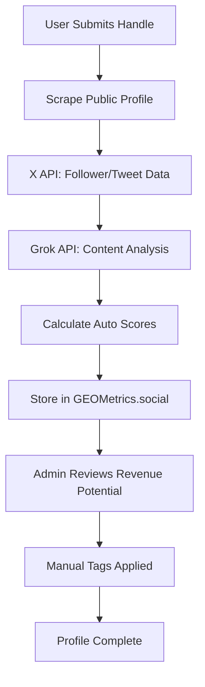

# Participant Profile Data Collection

## **Auto-Retrievable Data (via X API / Scraping):**

✅ **Directly Scrapable from Public Profile:**

```typescript
interface AutoRetrievableData {
  // Basic Identity
  handle: string;                    // @username
  displayName: string;               // Profile name
  bio: string;                       // Description text
  profileLink: string;               // x.com/username
  
  // Verification Status
  accountType: 'Premium' | 'Premium+' | 'Free'; // Blue/gold checkmark
  verificationDate: Date;            // When verified (if Premium)
  
  // Follower Metrics
  followerCount: number;
  followingCount: number;
  tweetCount: number;
  accountAge: Date;                  // Join date
  
  // Content Analysis (last 100 tweets)
  primaryTopics: string[];           // ML topic extraction
  postingFrequency: number;          // Tweets/day avg
  engagementRate: number;            // (Likes+RTs+Replies)/Followers
  averageTweetLength: number;
  hashtagUsage: number;              // Avg hashtags/tweet
  mediaUsage: number;                // % tweets with images/video
  
  // Network Quality
  verifiedFollowerRatio: number;     // % Premium followers
  mutualFollowerCount: number;       // Shared connections
  listMemberships: number;           // How many lists include them
}
```

✅ **Derived via AI Analysis (Grok API / GPT-4):**

```typescript
interface AIAnalyzedData {
  // Content Classification
  primaryNiche: string;              // "GEO Expert" vs "AI Consultant"
  nichePurity: number;               // 0-1 consistency score
  expertiseLevel: 'Beginner' | 'Intermediate' | 'Advanced';
  
  // Intent Detection (last 50 tweets)
  intentDistribution: {
    askingHelp: number;              // % seeking advice
    complaining: number;             // % venting/criticism
    sharing: number;                 // % sharing resources
    teaching: number;                // % educational content
    debating: number;                // % argumentative
  };
  
  // Tone Analysis
  languageTone: 'Casual' | 'Technical' | 'Emotional' | 'Direct';
  sentimentScore: number;            // -1 (negative) to 1 (positive)
  professionalismIndex: number;      // 0-1 formality score
  
  // Authority Markers
  citationFrequency: number;         // Times mentioned by others
  originalContentRatio: number;      // % original vs retweets
  thoughtLeadershipScore: number;    // Long-form thread quality
}
```

❌ **Requires Manual Input:**

```typescript
interface ManualInputRequired {
  // Challenge-Specific Tracking
  secondTouchDone: boolean;          // Completed profile replies
  replyRoleUsed: 'Diagnostician' | 'Contrarian' | 'Translator' | 'Catalyst';
  replyHookType: 'Question-Ended' | 'Contrarian' | 'Empathy-First' | 'Authority-Frame';
  
  // Revenue Qualification
  revenuePotential: 'Low' | 'Med' | 'High';
  revenueNotes: string;              // "Has budget", "Needs nurturing"
  
  // Custom Tags
  futurePromptTag: string;           // "AI Visibility Lead"
}
```

---

## **Enhanced Profile Schema:**

```typescript
interface SignalSpamParticipant {
  // Auto-Retrieved Identity
  handle: string;
  profileLink: string;
  accountType: 'Premium' | 'Premium+' | 'Free';
  
  // Auto-Analyzed Content
  primaryTopic: string;              // From AI analysis
  userIntentType: 'Asking Help' | 'Complaining' | 'Sharing' | 'Teaching' | 'Debating';
  audienceLevel: 'Beginner' | 'Intermediate' | 'Advanced';
  languageTone: 'Casual' | 'Technical' | 'Emotional' | 'Direct';
  
  // Auto-Calculated Scores
  accountScore: 1 | 2 | 3 | 4 | 5;   // Based on metrics
  signalStrength: number;            // 0-100 composite
  spamRisk: number;                  // 0-100 bot/spam likelihood
  
  // Manual Challenge Tracking
  secondTouchDone: boolean;
  replyRoleUsed?: 'Diagnostician' | 'Contrarian' | 'Translator' | 'Catalyst';
  replyHookType?: 'Question-Ended' | 'Contrarian' | 'Empathy-First' | 'Authority-Frame';
  
  // Revenue Intelligence
  revenuePotential: 'Low' | 'Med' | 'High';
  futurePromptTag?: string;
  
  // Challenge Performance
  signalContributions: {
    highQualityComments: number;
    thoughtfulQuoteTweets: number;
    profileOptimizationHelp: number;
    networkIntroductions: number;
  };
}
```

---

## **Data Collection Workflow:**



**Effort Estimate:**
- **Auto-retrieval:** 80% of data (via X API + Grok analysis)
- **Manual input:** 20% (revenue notes, custom tags)
- **Processing time:** ~30 seconds per profile

---