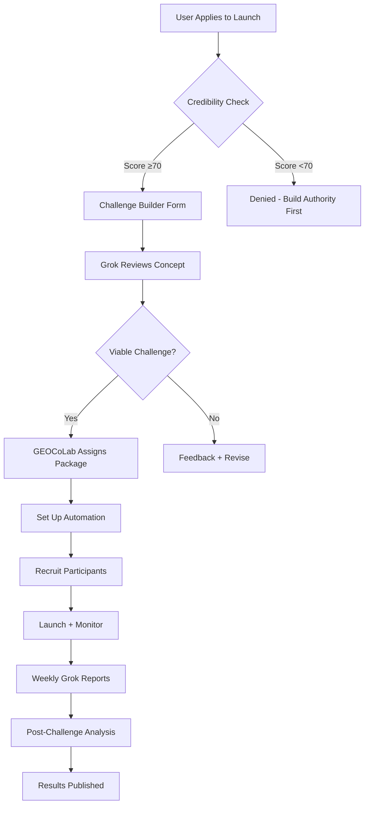

# Fan Club X Algo Cup Competition

## **Challenge Launchpad Framework:**

```typescript
interface CupLaunchedChallenge {
  // Creator Details
  creator: {
    handle: string;
    verificationLevel: 'Bronze' | 'Silver' | 'Gold' | 'Platinum';
    credibilityScore: number;       // Must be ≥70 to launch
  };
  
  // Challenge Configuration
  config: {
    name: string;                   // "30-Day AI Content Sprint"
    niche: string;                  // "AI Marketing"
    duration: number;               // Days
    maxParticipants: number;
    
    customRules: {
      entryRequirement: string;     // "Post 3x/week minimum"
      pointSystem: Record<string, number>; // Custom actions
      winCondition: string;         // "Most citations"
    };
  };
  
  // Grok Collaboration
  grokAssistance: {
    profileAudits: boolean;         // Auto-audit participants?
    contentSuggestions: boolean;    // Daily AI-generated prompts?
    performanceTracking: boolean;   // Real-time analytics?
  };
  
  // GEOCoLab Support
  geoColabPackage: 'DIY' | 'Managed' | 'White-Label';
  
  // Deliverables Validation
  deliverables: Array<{
    type: 'Thread' | 'Article' | 'Case Study' | 'Tool Launch';
    minQuality: number;             // 0-100 Grok score
    deadline: Date;
    reward: number;                 // Points for completion
  }>;
}
```

---

## **Grok Collaboration Layers:**

### **Layer 1: Auto-Audits (All Challenges)**

```typescript
interface GrokAutoAudit {
  participant: string;
  
  weeklyReport: {
    signalStrength: {
      current: number;
      change: number;               // vs last week
      trend: 'Improving' | 'Stable' | 'Declining';
    };
    
    contentQuality: {
      averageDepth: number;         // Character count + insights
      topicRelevance: number;       // On-niche %
      engagementPrediction: number; // AI-forecasted CTR
    };
    
    networkGrowth: {
      newFollowers: number;
      verifiedFollowerRatio: number;
      mutualConnections: number;
    };
    
    recommendations: string[];      // Top 3 action items
  };
}
```

**Delivery:** Every Sunday via DM + community post

---

### **Layer 2: Content Suggestions (Managed Challenges)**

```typescript
interface GrokContentEngine {
  challengeTheme: string;           // e.g., "AI Tools Week"
  
  dailyPrompts: Array<{
    day: number;
    prompt: string;                 // "Share your AI stack"
    format: 'Thread' | 'Quick Tweet' | 'Poll';
    expectedEngagement: number;     // Grok prediction
    
    participantCustomization: {
      handle: string;
      personalizedAngle: string;    // "Focus on your SaaS niche"
    }[];
  }>;
  
  realTimeFeedback: {
    draftAnalysis: (tweet: string) => {
      grokScore: number;            // 0-100 predicted performance
      improvements: string[];       // "Add a data point"
      bestPostTime: string;         // "3 PM EST based on your audience"
    };
  };
}
```

---

### **Layer 3: White-Label Challenges (Premium)**

```typescript
interface WhiteLabelChallenge {
  brand: {
    challengeName: string;          // "Acme AI Academy Sprint"
    customBranding: {
      logo: string;
      colorScheme: string;
      tagline: string;
    };
  };
  
  grokIntegration: {
    customModel: boolean;           // Train on brand content
    brandVoice: string;             // "Professional", "Playful"
    competitorTracking: string[];   // Monitor rival brands
  };
  
  geoColabServices: {
    fullManagement: boolean;        // We run everything
    weeklyReports: boolean;         // Analytics dashboard
    winnerSelection: 'AI' | 'Manual' | 'Hybrid';
  };
  
  pricing: {
    setupFee: number;               // $2,500
    perParticipant: number;         // $50/participant
    managementMonthly: number;      // $500/mo
  };
}
```

---

## **Challenge Effectiveness Validation (Grok + GEOCoLab):**

```typescript
interface ChallengeMetrics {
  // Participation Health
  signUpRate: number;               // % invited who joined
  completionRate: number;           // % finished all deliverables
  dropOffPoints: string[];          // Where people quit
  
  // Signal Quality
  avgSignalIncrease: number;        // Per-participant improvement
  spamIncidents: number;            // Flags raised
  highQualityOutputs: number;       // Deliverables scoring >80
  
  // Network Effects
  totalCitations: number;           // Cross-participant mentions
  externalAmplification: number;    // Non-participants sharing
  influencerNotices: number;        // >10K followers engaging
  
  // Business Impact (GEOCoLab Metrics)
  leadConversions: number;          // Challenge → client
  contentRepurposing: number;       // Threads → blog posts
  communityRetention: number;       // % staying active post-challenge
  
  // Grok Effectiveness
  predictionAccuracy: number;       // AI forecasts vs actual
  suggestionAdoptionRate: number;   // % using daily prompts
  automationTimesSaved: number;     // Hours saved via AI
}
```

---

## **Cup Launch Process:**



**Timeline:**
- **Application → Approval:** 48 hours
- **Setup → Launch:** 7 days
- **Challenge Duration:** User-defined (7-90 days)
- **Post-Analysis:** 14 days

---

## **PARTICIPANT ONBOARDING STEPS**

### **Pre-Competition (Days -7 to -1):**

#### **Step 1: Discovery & Application (Day -7)**

**Touchpoint:** User sees X post or referral link

**Action Required:**
1. Click signup link
2. Fill out interest form:
   ```typescript
   interface InterestForm {
     handle: string;
     email: string;
     niche: string;              // Dropdown
     currentFollowers: number;
     goals: string;              // Free text
     referredBy?: string;        // Optional
   }
   ```

**Auto-Trigger:** Welcome email with timeline

---

#### **Step 2: Profile Analysis (Day -6)**

**What Happens:**
- Grok API scrapes public profile
- AI calculates baseline scores
- Admin reviews for spam risk

**Participant Receives:**
```
Subject: Your Signal > Spam Profile - Baseline Report

Hi @username,

Great news! You're eligible for the Signal > Spam Challenge.

Here's your starting point:

📊 BASELINE METRICS
Signal Strength: 42/100 (Room to grow!)
Account Score: 3/5 (Solid foundation)
Primary Niche: AI Marketing (87% coherence)
Spam Risk: Low (7/100)

🎯 YOUR GROWTH POTENTIAL
Based on your profile, we predict:
• +150-200 Premium followers in 14 days
• 2-3x engagement on optimized content
• Top 25% finish in your niche leaderboard

Next step: Confirm participation by Jan 10.

[Confirm Button]
```

---

#### **Step 3: Onboarding Call/Video (Day -5)**

**Format:** Pre-recorded Loom (10 min) OR optional live Zoom (Fridays)

**Agenda:**
1. **Challenge Overview** (2 min)
   - What Signal > Spam means
   - Point system basics
   - Timeline walkthrough

2. **Your Custom Strategy** (3 min)
   - Based on AI analysis
   - "Your niche is X, so focus on Y actions"
   - Template recommendations

3. **Tool Setup** (3 min)
   - Access Google Sheet tracker
   - Join X Community
   - Install bookmarklet (optional tracking aid)

4. **Q&A Prompts** (2 min)
   - "What's your biggest X growth blocker?"
   - "What does success look like for you?"

---

#### **Step 4: Community Intro (Day -3)**

**Post Template:**
```
📣 NEW CHALLENGER INTRO

Drop your intro using this format:

🏷️ Handle: @yourhandle
🎯 Niche: [Your expertise]
🎨 What I post about: [1-sentence summary]
✅ Verified: [Premium/Premium+]
🏆 Challenge Goal: [Why you joined]

Example:
@JaneDoeGEO | GEO Consultant | Helping B2B SaaS dominate AI search | ✅ Premium | Goal: Build authority + hit 500 Premium followers

Let's connect! Reply with your top GEO question 👇
```

**Gamification:** First 50 intros get +25 bonus points

---

#### **Step 5: Action Plan Creation (Day -2)**

**Interactive Worksheet:**
```typescript
interface ActionPlan {
  participant: string;
  
  weeklyCommitments: {
    postsPerWeek: number;         // Min 3
    commentsPerDay: number;       // Min 5
    threadsPerWeek: number;       // Min 1
    quoteTweetsPerWeek: number;   // Min 2
  };
  
  contentThemes: string[];        // Top 3 topics
  
  accountabilityPartner?: string; // Optional buddy system
  
  weeklyCheckIns: 'Monday' | 'Wednesday' | 'Friday'; // Preferred
  
  streakGoal: number;             // Days active (target 14)
}
```

**Deliverable:** Participant submits plan, gets AI feedback

---

#### **Step 6: Welcome Package (Day -1)**

**Email Contents:**
1. **Challenge Checklist** (PDF)
   - Daily tasks
   - Point tracker
   - Template library access

2. **Exclusive Resources:**
   - "10


## **Competition Week (Days 1-14):**

### **Daily Routine:**

**Morning (9 AM):**
- Check community for daily prompt
- Review leaderboard position
- Plan day's content

**Midday (12 PM):**
- Post scheduled content
- Engage with 5+ participants (3-2-1 rule)
- Track points in sheet

**Evening (6 PM):**
- Respond to comments/mentions
- Check daily challenge thread
- Update action plan

---

### **Weekly Milestones:**

**Week 1:**
- **Mon:** Orientation call
- **Wed:** First skill swap deadline
- **Fri:** Mini-leaderboard (top 10 highlighted)
- **Sun:** Week 1 audit results via email

**Week 2:**
- **Mon:** Power-up week kickoff
- **Wed:** Grok Office Hours (live)
- **Fri:** Final push challenge
- **Sun:** Winners announcement

---

## **Post-Competition (Days 15+):**

### **Step 7: Results & Recognition (Day 15)**

**Deliverables:**
1. **Personal Report Card:**
   ```typescript
   interface FinalReport {
     beforeAfter: {
       followers: { start: number; end: number; growth: number };
       signalStrength: { start: number; end: number; improvement: number };
       engagement: { start: number; end: number; change: number };
     };
     
     achievements: string[];       // Badges earned
     rank: number;                 // Final position
     
     topContributions: string[];   // Your best posts
     citationNetwork: {
       mentioned: string[];        // Who cited you
       cited: string[];            // Who you elevated
     };
     
     nextSteps: string[];          // Personalized recommendations
   }
   ```

2. **Public Recognition:**
   - Top 10 featured in blog post
   - All finishers get completion badge
   - Testimonial requests

3. **Ongoing Options:**
   - Join alumni community (free)
   - Enroll in next challenge ($49)
   - Book GEO audit (discounted)

---

## **Onboarding Success Metrics:**

| Metric | Target | Measurement |
|--------|--------|-------------|
| Application → Confirmation | 70% | Email opens |
| Profile Analysis → Approval | 85% | Low spam rate |
| Onboarding Video Completion | 60% | Watch time |
| Community Intro Posting | 90% | First 48 hours |
| Action Plan Submission | 75% | By Day -1 |
| Week 1 Activity | 80% | Daily posts |
| Challenge Completion | 65% | All deliverables |

---

## **Revenue Model for Club Fan Launched Competition:**

| Package | Price | Grok Features | GEOCoLab Support |
|---------|-------|---------------|------------------|
| **DIY** | Free | Auto-audits only | Template + FAQ |
| **Managed** | $500 | Full AI suite | Weekly check-ins |
| **White-Label** | $2,500 + $50/participant | Custom model | Full management |

**Incentive:** Challenge creators get **10% of participant upgrades** (e.g., if 5 participants buy GEO audits, creator earns $148.50)

---

## **ADDITIONAL COMPETITION FEATURES (Beyond Reciprocal Actions)**

### **Advanced Signal-Building Features:**

#### **1. Profile Optimization Coaching**

**Feature:** AI-powered bio/content audit for participants

```typescript
interface ProfileOptimization {
  bioAudit: {
    clarityScore: number;           // Is your niche clear?
    keywordDensity: number;         // GEO-relevant terms
    ctaPresence: boolean;           // Clear call-to-action?
    suggestions: string[];          // "Add '15 years in AI SEO'"
  };
  
  contentAudit: {
    topicCoherence: number;         // Staying on-brand?
    engagementPatterns: {           // When do you get traction?
      bestPostingTimes: string[];
      highPerformingFormats: string[]; // Threads vs short posts
    };
    gapAnalysis: string[];          // "You never post case studies"
  };
  
  networkAudit: {
    followerQuality: number;        // Verified ratio
    influencerConnections: number;  // How many >10K followers?
    mutualEngagement: number;       // Who actually replies to you?
  };
}
```

**Challenge Integration:**
- **Week 1:** Every participant gets a free AI audit
- **Bonus Points:** +50 for implementing ≥3 suggestions
- **Accountability:** Post before/after screenshots (+100 points)

---

#### **2. Niche Authority Leaderboards**

**Feature:** Topic-specific rankings (beyond just points)

```typescript
interface NicheLeaderboard {
  category: 'GEO Expert' | 'AI Consultant' | 'SEO Specialist' | 'SaaS Founder';
  rankings: Array<{
    handle: string;
    authorityScore: number;         // Content quality + citations
    signalStrength: number;         // High-intent engagement
    citationCount: number;          // Times mentioned by others
    teachingContributions: number;  // Helpful replies given
  }>;
}
```

**Why It Works:**
- Multiple paths to "win" (not just volume)
- Encourages thought leadership over spam
- Creates sub-communities within the challenge

---

#### **3. Collaborative Content Sprints**

**Feature:** Weekly theme-based content creation

```typescript
interface ContentSprint {
  week: number;
  theme: string;                    // "AI Citation Strategies"
  challenge: {
    format: 'Thread' | 'Article' | 'Video' | 'Case Study';
    minLength: number;              // 5-tweet thread minimum
    mustInclude: string[];          // ["data", "examples", "tools"]
  };
  
  rewards: {
    topContributor: number;         // +200 points
    mostCited: number;              // +150 if others link/quote you
    communityVote: number;          // +100 for best peer-voted
  };
}
```

**Example Themes:**
- Week 1: "How I Got AI-Cited" (success stories)
- Week 2: "GEO Mistakes I Made" (vulnerability builds trust)
- Week 3: "Tool Stack Deep Dive" (show your process)
- Week 4: "Predict the Future" (thought leadership)

---

#### **4. Skill-Swap Marketplace**

**Feature:** Formalized expertise exchange

```typescript
interface SkillSwap {
  offerer: string;                  // @handle
  skill: string;                    // "SEO audit"
  wants: string;                    // "AI chatbot setup"
  commitment: 'Quick Call' | '30-Min Session' | 'Async Review';
  
  completedSwaps: number;           // Reputation metric
  rating: number;                   // 1-5 stars from partners
}
```

**Challenge Integration:**
- **Match participants** based on complementary skills
- **+75 points** per completed swap
- **Badge system:** "Expert Trader" for 5+ swaps

---

#### **5. Citation Network Mapping**

**Feature:** Visualize who's amplifying whom

```typescript
interface CitationNetwork {
  participant: string;
  
  citedBy: Array<{
    handle: string;
    citationType: 'Mention' | 'Quote Tweet' | 'Thread Link';
    context: string;                // What they said about you
    reach: number;                  // Their follower count
  }>;
  
  citing: Array<{
    handle: string;
    yourContext: string;            // What you said about them
  }>;
  
  networkScore: number;             // Weighted by reach + reciprocity
}
```

**Why It Matters:**
- **Grok prioritizes citation networks** for authority
- Participants see **who's amplifying them** (and reciprocate)
- Creates **virtuous loops** of mutual elevation

---

#### **6. AI-Optimized Tweet Templates**

**Feature:** Grok-curated content frameworks

```typescript
interface TweetTemplate {
  name: string;                     // "The Data Hook"
  structure: string;                // "Stat + Insight + CTA"
  example: string;
  grokScore: number;                // Predicted engagement
  
  variables: {
    placeholder: string;            // "{YOUR_STAT}"
    guidance: string;               // "Use a surprising number"
  }[];
}
```

**Library Examples:**
1. **The Data Hook:** "X% of businesses don't know [problem]. Here's why..."
2. **The Contrarian Take:** "Everyone says [common belief]. But here's what data shows..."
3. **The Case Study Mini:** "Client went from X to Y in Z days. Thread 👇"
4. **The Question Ladder:** "If you could only fix one GEO issue, which? [Poll + analysis]"

**Challenge Integration:**
- **Daily template drops** in the community
- **+25 points** for using template + tagging #SignalNotSpam
- **Leaderboard** for template performance

---

#### **7. Grok "Office Hours" Sessions**

**Feature:** Weekly live Q&A with AI optimization focus

```typescript
interface GrokOfficeHours {
  schedule: 'Wednesdays 3 PM EST';
  format: 'Twitter Spaces';
  
  agenda: {
    profileRoasts: number;          // 3 random participants audited live
    hotSeatQA: number;              // 5 attendees get direct coaching
    communityAMA: boolean;          // Open questions
  };
  
  recordingAccess: 'All Participants';
  bonusPoints: number;              // +50 for attending live
}
```

---

#### **8. Anti-Spam Accountability System**

**Feature:** Peer-review flagging mechanism

```typescript
interface SpamFlag {
  reporter: string;
  flagged: string;
  reason: 'Generic Comments' | 'Follow-Unfollow' | 'Link Spam' | 'Bot Behavior';
  evidence: string;                 // Screenshot/link
  
  review: {
    moderator: string;
    verdict: 'Confirmed' | 'Warning' | 'False Flag';
    action: 'Point Deduction' | 'Suspension' | 'Ban' | 'None';
  };
}
```

**Why It's Different:**
- **Community policing** keeps standards high
- **Transparency:** Public moderation log
- **False flag penalties:** -25 points for frivolous reports

---

### **Summary of New Features:**

| Feature | Signal Boost | Engagement Driver | Grok Alignment |
|---------|--------------|-------------------|----------------|
| Profile Audit Checklist | ⭐⭐⭐⭐⭐ | Medium | High |
| Profile Optimization Coaching | ⭐⭐⭐⭐⭐ | Medium | High |
| Niche Authority Leaderboards | ⭐⭐⭐⭐ | High | High |
| Collaborative Content Sprints | ⭐⭐⭐⭐⭐ | Very High | Very High |
| Skill-Swap Marketplace | ⭐⭐⭐ | Medium | Medium |
| Citation Network Mapping (their current state) | ⭐⭐⭐⭐⭐ | High | Very High |
| Grok-Optimized Tweet Templates | ⭐⭐⭐⭐ | Very High | High |
| Grok Office Hours | ⭐⭐⭐ | High | Very High |
| Anti-Spam Accountability | ⭐⭐⭐⭐⭐ | Low (but critical) | Very High |

3. **Community Guidelines** (1-pager)

4. **First Week Schedule:**
   ```
   Day 1: Intro post + engage with 10 intros
   Day 2: Share your profile optimization plan
   Day 3: Post first template-based thread
   Day 4: Skill swap signup
   Day 5: Cite 3 participants in your content
   Day 6-7: Reflect & plan Week 2
   ```
---


