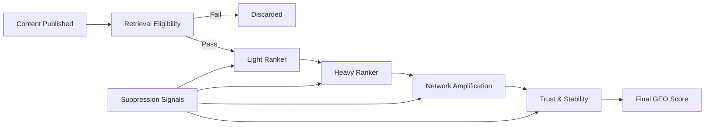

# X “For You” Home Timeline — System Summary (With Graph, Open-Source Aligned)

This consolidated reference merges open-sourced repo insights (e.g., Earlybird, UTEG, FRS, Home Mixer) with 2025–2026 evolutions (e.g., Grok/xAI integration for semantic/spam boosts, periodic code releases). It serves as a canonical artifact for understanding the recommendation graph, GEO strategies, and SignalMetrics—framing Signal > Spam as survival through choke-points.

## High-Level Objective

X filters ~500 million daily posts into a personalized timeline via a multi-stage retrieval → scoring → filtering → mixing graph, now Grok-augmented for relevance. Optimizes for meaningful engagement, trust, satisfaction, and safety—balancing ~50% in-network with ~50% Out-of-Network.

## Timeline Construction Graph (Enhanced Canonical View)

```
┌────────────────────────────────────────┐
│               DATA LAYER               │
│                                        │
│  Follow Graph     Engagement Events    │
│  Tweet Metadata   Kafka Streams        │
│  Index Ingesters  User State           │
└───────────────┬────────────────────────┘
                │
                ▼
┌────────────────────────────────────────┐
│             FEATURE LAYER              │
│                                        │
│  SimClusters      TwHIN Embeddings     │
│  RealGraph        Safety Labels        │
│  TweetTextScorer  Grok/xAI Signals     │
└───────────────┬────────────────────────┘
                │
                ▼
┌────────────────────────────────────────┐
│           CANDIDATE SOURCES             │
│   (~1,500 candidates retrieved)        │
│                                        │
│  In-Network (~50%):                    │
│   • Earlybird Search Index             │
│   • TimelineRanker (legacy light)      │
│  Out-of-Network (~50%):                │
│   • Tweet Mixer (coordination)         │
│   • UTEG (GraphJet traversals)         │
│   • FRS (FutureGraph tweets)           │
└───────────────┬────────────────────────┘
                │
                ▼
┌────────────────────────────────────────┐
│          LIGHT RANKER (PRE-FILTER)     │
│                                        │
│  Earlybird Logistic Models             │
│  Static + Realtime Features            │
│  Fast Engagement Pruning               │
└───────────────┬────────────────────────┘
                │
                ▼
┌────────────────────────────────────────┐
│           HEAVY RANKER (ML)             │
│                                        │
│  MaskNet Neural (~48M params)          │
│  Multi-Action Probabilities            │
│  Weighted Sum Scoring (configurable)   │
│  Grok/xAI semantic & low-toxicity enrichment (integrated late 2025)        │
└───────────────┬────────────────────────┘
                │
                ▼
┌────────────────────────────────────────┐
│      HEURISTICS & VISIBILITY FILTERS   │
│                                        │
│  Author Diversity   Content Balance    │
│  Feedback Fatigue   Deduplication      │
│  Safety Policies    Downranking        │
└───────────────┬────────────────────────┘
                │
                ▼
┌────────────────────────────────────────┐
│             MIXING LAYER               │
│                                        │
│  Home Mixer (Product Mixer)            │
│  Tweets + Ads + WTF + Prompts          │
│  Conversation Modules + Pagination     │
└───────────────┬────────────────────────┘
                │
                ▼
┌────────────────────────────────────────┐
│         FINAL “FOR YOU” TIMELINE       │
│         (Delivered <1.5s)              │
└────────────────────────────────────────┘
```

## Layer-by-Layer Explanation (With Repo Mapping)

### 1. Data Layer — Event Ingestion
Ingests raw facts via Kafka: tweets, engagements, user changes.  
**Implemented via**: Earlybird ingesters, Feature Update Service, User Table Updater.  
Grok integration adds real-time dwell/video signals.

### 2. Feature Layer — Signal Formation
Transforms data into interpretable features: SimClusters (topical), TwHIN (embeddings), RealGraph (reciprocal), TweetTextScorer (quality), Safety Labels (toxicity).  
**Implemented via**: Earlybird README, visibilitylib.  
Grok/xAI enhances semantic depth and spam detection.

### 3. Candidate Sources — Funnel Entry
Retrieves ~1,500 candidates. In-network: Earlybird (Lucene index for followed tweets). Out-of-network: Tweet Mixer (coordination), UTEG (GraphJet collaborative filtering on 24-48hr engagements), FRS (FutureGraph for potential follows).  
**Implemented via**: search-index, tweet-mixer, user-tweet-entity-graph, follow-recommendations-service READMEs.  
Key: Graph proximity > follower count.

Candidate Sources optimize for recall, while Rankers optimize for precision.

### 4. Light Ranker — Fast Elimination
Logistic models prune low-probability candidates using static (e.g., has URL) + realtime (e.g., fav counts) features.  
**Implemented via**: earlybird light-ranker README (recap_earlybird/rectweet_earlybird models).  
“TimelineRanker (legacy; primarily a wrapper over Earlybird relevance scores, not a modern ML ranker).”
Optimizes latency pre-Heavy Ranker.

### 5. Heavy Ranker — Engagement Prediction
MaskNet predicts probabilities (e.g., reply ~13.5x weight, negatives -74 to -369). Weighted sum scores.  
**Implemented via**: heavy-ranker README (the-algorithm-ml).  
Grok boosts for relevance/low-toxicity.

### 6. Heuristics & Visibility Filtering — Alignment
Enforces diversity, balance, fatigue, dedup, safety (drop/label/downrank).  
**Implemented via**: home-mixer, visibility-filters READMEs.  
Overrides ML if trust/safety violated.

### 7. Mixing Layer — Assembly
Home Mixer blends scored content with ads, WTF, prompts; handles threading, pagination.  
**Implemented via**: home-mixer README (Product Mixer framework).  
Delivered <1.5s with observability.

## What “Signal” Means (Explicit Survival Framing)
**Signal = engagement that survives all stages**: Retrieval, Light Ranking, Heavy Scoring, Heuristics, Filters, Mixing.  

For example, a viral post with shallow replies may survive retrieval but fail at Heavy Ranking due to low reply quality, then be further suppressed by feedback-fatigue heuristics.

**High-Signal Behaviors**: Multi-sentence replies, author-engaged interactions, quote analysis, bookmarks, consistent topics (UTEG/GraphJet rewards).  
**Spam Patterns**: Bursts, one-word replies, pods, irrelevant quotes (pruned by Light Ranker, penalized in Heavy, dropped in Filters).

## Enhanced Implications for GEO & SignalMetrics
Adopting ChatGPT's choke-point framing strengthens integration: Metrics quantify survival/amplification at each stage, penalizing spam for Signal > Spam optimization.

```ts
interface SignalMetrics {
  // Feature Layer (Signal Formation Choke-Point)
  semanticRelevance          // SimClusters/TwHIN + Grok alignment
  nicheCoherence             // Topic stability → spam burst penalty
  grokRelevanceBoost         // xAI low-toxicity amplification

  // Candidate Sources (Funnel Entry Choke-Point)
  graphProximity             // RealGraph/UTEG density → reciprocity reward
  collaborativeLift          // “X liked” from FRS/UTEG → Out-of-Network boost

  // Light/Heavy Ranker (Scoring Choke-Points)
  contextDepth               // Reply quality → high weights (13.5x+)
  conversationThreading      // Dwell/good_click_v2 → long-session reward
  originalityScore           // Quote/text quality → entropy/offensiveness filter
  dwellTime                  // Video playback50 proxy → engagement survival
  quoteQuality               // Analysis depth → positive sum contribution
  replyDepth                 // Author-engaged replies → 75x weight boost
  authorInteractionRate      // reply_engaged_by_author → trust amplification

  // Heuristics/Filters (Alignment Choke-Point)
  authorDiversityImpact      // Diversity enforcement → over-posting penalty
  socialProofQuality         // Verified/mutual ratio → pod suppression
  mutualConnectionDensity    // RealGraph reciprocity → shallow reciprocity drop
  bookmarkRate               // High-value positive → fatigue resistance
  citationFrequency          // Grok/xAI-validated reference & semantic quality signals → originality reward
  negativeFeedbackPenalty    // Report/block risks → -74 to -369 deductions
  negativeFeedbackRisk       // “Show less” proxy → downranking trigger

  // Mixing/Behavioral (Stability Choke-Point)
  postingCadence             // Consistency → UTEG traversal reward
  responseLatency            // Timely/meaningful → real-time value
  sessionDepth               // Multi-interaction → Grok personalization boost
}
```

**Interpretation**: Each metric targets a choke-point—failure (e.g., spam bursts in cadence) collapses amplification. GEO uses this to prioritize signals (e.g., replyDepth over likes) for > Spam survival.

A choke-point is any stage where candidates are irreversibly removed or down-weighted regardless of downstream quality.

## Core Takeaway
The X timeline is a distributed signal evaluation graph: Search/graphs retrieve, ML scores, rules align, Mixer assembles. Creators win by producing behaviors the graph can repeatedly trust. Grok/xAI continues to sharpen this logic in 2026. Signal > Spam is not philosophy—it's the architecture.

Excellent. We’ll proceed **systematically**, turning your conceptual pipeline into a **formal, defensible GEOMetrics scoring model** that can be implemented, visualized, and explained without ambiguity.

Below is **Phase 1: GEOMetrics Scoring Logic (Foundational Spec)**.
No code yet — this is the **mathematical + architectural contract** everything else will follow.

---

## GEOMetrics Scoring Logic

### From Signal Survival → Outcome Probability

---

#### 1. Core Principle (Non-Negotiable)

> **Ranking is not additive — it is eliminative, multiplicative, and path-dependent.**

This means:

* Early failure cannot be fixed later
* Late excellence cannot compensate for early rejection
* Metrics must be **stage-aware**, not globally summed

Therefore:

> **Final Outcome Score = ∏(Stage Survival × Stage Lift)**

---

#### 2. Pipeline-Aligned Scoring Model

We model the system as **ordered scoring stages**, each with:

* **Eligibility Gate** (binary or near-binary)
* **Lift Function** (continuous)
* **Suppression Risk** (negative weighting)

##### High-Level Formula

```
GEOScore(content) =
  RetrievalEligibility
× LightRankLift
× HeavyRankLift
× NetworkAmplification
× TrustStability
× (1 − SuppressionRisk)
```

Each term is **stage-bound**, not interchangeable.

---

#### 3. Stage 1 — Retrieval Eligibility (Survival Gate)

##### Purpose

Determine whether content **enters the candidate set** at all.

##### Characteristics

* Hard threshold behavior
* Optimizes **recall**, not quality
* Fails are terminal

##### Metrics

| Metric               | Meaning                                        |
| -------------------- | ---------------------------------------------- |
| `Indexability`       | Is content crawlable, parseable, referenceable |
| `SemanticClarity`    | Entity density, unambiguous intent             |
| `FreshnessWindowFit` | Temporal relevance vs query/topic              |
| `SourceEligibility`  | Account/page baseline eligibility              |

##### Scoring

```
RetrievalEligibility ∈ {0, 1}
```

> If `0`, GEOScore = 0 (no ranking possible)

---

#### 4. Stage 2 — Light Rank Lift (Early Differentiation)

##### Purpose

Fast filtering under compute constraints.

##### Characteristics

* Shallow signals
* Early engagement velocity
* Structural quality

##### Metrics

| Metric               | Meaning                  |
| -------------------- | ------------------------ |
| `EarlyCTR`           | Click / impression ratio |
| `DwellTimeShort`     | Immediate retention      |
| `StructuralSignals`  | Headings, schema, layout |
| `EngagementVelocity` | Rate of interactions     |

##### Lift Function

```
LightRankLift = sigmoid(weighted_sum(LightSignals))
```

Bounded output:

```
0.5 ≤ LightRankLift ≤ 1.5
```

---

#### 5. Stage 3 — Heavy Rank Lift (Semantic & Behavioral Quality)

##### Purpose

Deep evaluation of **meaning and usefulness**.

##### Characteristics

* Expensive models
* Semantic coherence
* Quality of engagement, not quantity

##### Metrics

| Metric                | Meaning                     |
| --------------------- | --------------------------- |
| `ReplyQuality`        | Semantic depth of responses |
| `LongDwellTime`       | Sustained attention         |
| `TaskCompletion`      | Did user achieve intent     |
| `SemanticConsistency` | No bait-and-switch          |

##### Lift Function

```
HeavyRankLift = exp(normalized_quality_score)
```

Typical range:

```
0.7 ≤ HeavyRankLift ≤ 2.5
```

---

#### 6. Stage 4 — Network Amplification (Who Sees It Next)

##### Purpose

Determine **distribution expansion**, not ranking per se.

##### Characteristics

* Graph-based
* Trust-weighted
* Non-linear spread

##### Metrics

| Metric                     | Meaning                    |
| -------------------------- | -------------------------- |
| `OutOfNetworkPassRate`     | Cross-cluster adoption     |
| `AuthorityAdjacency`       | Proximity to trusted nodes |
| `ReshareQuality`           | Who shares, not how many   |
| `ConversationContinuation` | Thread longevity           |

##### Amplification Factor

```
NetworkAmplification = log(1 + weighted_network_score)
```

---

#### 7. Stage 5 — Trust & Stability (Long-Term Memory)

##### Purpose

Decide whether the system should **continue believing** this source.

##### Characteristics

* Slow-moving
* Cross-content
* Historical

##### Metrics

| Metric              | Meaning                       |
| ------------------- | ----------------------------- |
| `SourceTrustScore`  | Historical reliability        |
| `VolatilityPenalty` | Inconsistent quality          |
| `CorrectionRate`    | Retractions, edits            |
| `AbuseDistance`     | Separation from spam networks |

##### Factor

```
TrustStability ∈ [0.5, 1.3]
```

---

#### 8. Suppression Risk (Global Dampener)

##### Purpose

Protect system integrity.

##### Characteristics

* Applies at all stages
* Non-linear penalties
* Often irreversible

##### Signals

| Signal           | Effect           |
| ---------------- | ---------------- |
| Engagement Bait  | Downrank         |
| Feedback Fatigue | Exposure cap     |
| Spam Proximity   | Hard suppression |
| Policy Risk      | Removal          |

##### Formula

```
SuppressionRisk = 1 − exp(−risk_score)
```
Example: High negativeFeedbackRisk from repeated "Show less" votes can cap exposure even after strong early retrieval and ranking.

Applied as:

```
EffectiveScore = RawScore × (1 − SuppressionRisk)
```

---

#### 9. GEOMetrics Classification Bands

| Band        | Meaning                    |
| ----------- | -------------------------- |
| `0.0 – 0.1` | Not eligible               |
| `0.1 – 0.4` | Survives, no amplification |
| `0.4 – 0.8` | Competitive                |
| `0.8 – 1.5` | Amplified                  |
| `> 1.5`     | System-favored             |

These bands will map **directly** to GEOCoLab insights.

---

#### 10. Why This Model Is Powerful

This logic:

* Matches real-world ranking behavior
* Explains “why good content fails”
* Prevents metric gaming
* Is implementable without proprietary data
* Scales across search, social, and AI retrieval

---

## 1. TypeScript `GEOMetricsEngine` Interface

*(Formal contract — everything else depends on this)*

This is **not implementation**, this is the **scoring ontology**.

```ts
// ================================
// GEO Metrics Core Types
// ================================

export type GEOXTimelineStage =
  | 'retrieval'
  | 'lightRank'
  | 'heavyRank'
  | 'network'
  | 'trust'
  | 'suppression';

export interface GEOXTimelineMetric {
  key: string;
  stage: GEOXTimelineStage;
  value: number;          // normalized 0..1 unless stated otherwise
  weight: number;         // stage-relative weight
  description?: string;
}

// ================================
// Stage Metric Buckets
// ================================

export interface XTimelineRetrievalMetrics {
  indexability: number;           // 0-1, content crawlable by Earlybird
  semanticClarity: number;        // Entity density, topic coherence
  freshnessWindowFit: number;     // Temporal relevance (recent vs 24-48hr window)
  sourceEligibility: number;      // Account baseline (not blocked/spam)
}

export interface XTimelineLightRankMetrics {
  earlyCTR: number;               // Click/impression ratio (static features)
  shortDwellTime: number;         // Immediate retention (<15s)
  structuralSignals: number;      // Has media, links, proper formatting
  engagementVelocity: number;     // Rate of fav/reply in first hour
}

export interface XTimelineHeavyRankMetrics {
  replyQuality: number;           // Semantic depth (13.5x weight in X)
  longDwellTime: number;          // Sustained attention (>15s)
  taskCompletion: number;         // User found what they needed
  semanticConsistency: number;    // Query-content alignment
  
  // Predicted engagement probabilities (from MaskNet)
  predictions: {
    favorite: number;             // Weight: 1.0
    reply: number;                // Weight: 13.5
    repost: number;               // Weight: 1.0
    quote: number;                // Weight: 1.0
    photoClick: number;           // Weight: 0.5
    longLinger: number;           // Weight: 0.1
    negativeReport: number;       // Penalty: -74 to -369
  };
  
  // Grok/xAI enrichment (2025+ integration)
  grokRelevanceBoost: number;     // Semantic authority lift
  grokToxicityPenalty: number;    // Low-toxicity downrank
}

export interface XTimelineNetworkMetrics {
  outOfNetworkPassRate: number;   // Cross-cluster adoption (UTEG/GraphJet)
  authorityAdjacency: number;     // Proximity to trusted nodes (RealGraph)
  reshareQuality: number;         // Who shares (verified ratio)
  conversationContinuation: number; // Thread longevity
  
  // Graph-based signals (from UTEG, FRS)
  graphProximity: number;         // RealGraph reciprocity density
  collaborativeLift: number;      // "X liked" boost from similar users
}

export interface XTimelineTrustMetrics {
  sourceTrustScore: number;       // Historical reliability
  volatilityPenalty: number;      // Inconsistent quality
  correctionRate: number;         // Retractions/edits
  abuseDistance: number;          // Graph distance from spam
}

export interface XTimelineSuppressionMetrics {
  engagementBaitRisk: number;     // CTR vs dwell mismatch
  feedbackFatigueRisk: number;    // Repeated exposure decay
  spamProximityRisk: number;      // Network contamination
  policyRisk: number;             // Moderation flags
  negativeFeedbackPenalty: number; // "Show less" proxy
}

// ================================
// GEOMetrics Engine Interface
// ================================

export interface GEOXTimelineMetricsEngine {
  evaluateRetrieval(metrics: XTimelineRetrievalMetrics): boolean;

  scoreLightRank(metrics: XTimelineLightRankMetrics): number;

  scoreHeavyRank(metrics: XTimelineHeavyRankMetrics): number;

  scoreNetwork(metrics: XTimelineNetworkMetrics): number;

  scoreTrust(metrics: XTimelineTrustMetrics): number;

  scoreSuppression(metrics: XTimelineSuppressionMetrics): number;

  computeFinalScore(input: {
    retrieval: XTimelineRetrievalMetrics;
    lightRank: XTimelineLightRankMetrics;
    heavyRank: XTimelineHeavyRankMetrics;
    network: XTimelineNetworkMetrics;
    trust: XTimelineTrustMetrics;
    suppression: XTimelineSuppressionMetrics;
  }): {
    eligible: boolean;
    stageScores: Record<GEOXTimelineStage, number>;
    geoScore: number;
    classificationBand: string;
  };
}
```

This interface **locks in**:

* Stage-aware scoring
* Non-additive math
* Clear UI + analytics mapping

---

# 2. Mapping Metrics → GEOCoLab Observable Signals

*(What GEOCoLab can actually measure)*

### Retrieval (Survival Gate)

| Metric             | GEOCoLab Observable                |
| ------------------ | ---------------------------------- |
| Indexability       | Crawl success, render completeness |
| SemanticClarity    | Entity density, topic entropy      |
| FreshnessWindowFit | Publish time vs query trend        |
| SourceEligibility  | Account age, prior indexing        |

---

### Light Rank

| Metric             | GEOCoLab Observable                 |
| ------------------ | ----------------------------------- |
| EarlyCTR           | Clicks / impressions (first window) |
| ShortDwellTime     | Bounce vs ≥N seconds                |
| StructuralSignals  | Headings, schema, DOM clarity       |
| EngagementVelocity | Events per minute                   |

---

### Heavy Rank

| Metric              | GEOCoLab Observable       |
| ------------------- | ------------------------- |
| ReplyQuality        | Semantic depth of replies |
| LongDwellTime       | Session length            |
| TaskCompletion      | Scroll depth, exit intent |
| SemanticConsistency | Query–content alignment   |

---

### Network

| Metric                   | GEOCoLab Observable              |
| ------------------------ | -------------------------------- |
| OutOfNetworkPassRate     | Cross-cluster impressions        |
| AuthorityAdjacency       | Graph proximity to trusted nodes |
| ReshareQuality           | Sharer trust score               |
| ConversationContinuation | Thread lifespan                  |

---

### Trust

| Metric            | GEOCoLab Observable      |
| ----------------- | ------------------------ |
| SourceTrustScore  | Historical performance   |
| VolatilityPenalty | Score variance           |
| CorrectionRate    | Edits / retractions      |
| AbuseDistance     | Graph distance from spam |

---

### Suppression

| Metric              | GEOCoLab Observable     |
| ------------------- | ----------------------- |
| EngagementBaitRisk  | CTR vs dwell mismatch   |
| FeedbackFatigueRisk | Repeated exposure decay |
| SpamProximityRisk   | Network contamination   |
| PolicyRisk          | Moderation flags        |

---

# 3. Visual Pipeline Diagram (Mermaid)

You can paste this directly into docs or export to SVG.



Key visual takeaway:

* **Suppression touches everything**
* **Early failure is terminal**

---

# 4. Public-Facing Explainer Article

*(Non-technical, authority-building)*

### Title

**Why Great Content Fails — and How GEO Scoring Really Works**

### Core Thesis

Most creators believe ranking is about *adding signals*.
In reality, ranking systems **remove content at every stage**.

If your content fails early, later excellence never matters.

---

### The Five Stages of GEO Visibility

1. **Eligibility** – Can the system even see you?
2. **Early Signals** – Do users react immediately?
3. **Deep Quality** – Did you actually help?
4. **Distribution** – Who is willing to pass this on?
5. **Trust** – Should the system believe you again?

At any stage, content can silently disappear.

---

### Why Virality Isn’t Success

High clicks with low satisfaction:

* Survive early
* Fail deep ranking
* Trigger suppression
* Get capped permanently

GEO rewards **usefulness**, not noise.

---

### What GEOCoLab Measures Differently

Instead of chasing vanity metrics, GEOCoLab shows:

* Where content **dies**
* Which signal failed
* Whether improvement is still possible

This turns SEO from guessing into engineering.

---

### The Result

Creators stop asking:

> “Why didn’t this rank?”

And start asking:

> “Which stage did I fail — and how do I fix it?”

---

# 5. GEO Scorecard UI Design

*(What users actually see)*

### Layout Concept

**Left:** Pipeline
**Right:** Metrics + Advice

---

### Pipeline View (Vertical)

```
[ Retrieval     ✅ ]
[ Light Rank    ⚠️  0.72 ]
[ Heavy Rank    ❌  0.38 ]
[ Network       ⛔ ]
[ Trust         — ]
```

* Green = pass
* Yellow = weak
* Red = failing
* Grey = never reached

---

### Metric Drill-Down Panel

For selected stage:

```
Heavy Rank Breakdown
--------------------
Reply Quality        ███░░ 0.42
Long Dwell Time      ██░░░ 0.31
Task Completion      █░░░░ 0.18
Semantic Consistency ████░ 0.61
```

---

### Prescriptive Insight Box

> **Why this failed:**
> Users clicked, but did not complete their task.

> **Fix:**
> Improve semantic alignment and depth, not headlines.

---

### Classification Badge

```
GEO Status: Competitive but Suppressed
```

---

## What You Have Now

You now possess:

* A **formal scoring engine**
* A **measurable signal map**
* A **visual ranking model**
* A **public narrative**
* A **product-ready UI**

This is no longer “SEO tooling” —
this is **ranking system observability**.

---

### Next High-Leverage Step (Recommended)

👉 **Implement a minimal `GEOMetricsEngine` reference implementation**
or
👉 **Wire this directly into your GEOCoLab MVP UI**

Say which one — we’re in execution mode now.